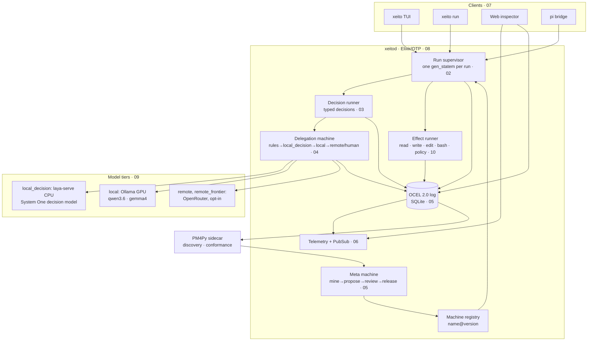

# Xeito architecture — overview

Draft v0.1 · 2026-09-27 · One-page summary: [../design.md](../design.md) · Build order: [../implementation-plan.md](../implementation-plan.md)

## In one paragraph

Xeito is a small, pi-style agent harness. Every task runs as a **versioned statechart** on Erlang's `gen_statem`.
Language models are consulted only to make **typed decisions**: closed-type choices with confidence, taken among the transitions the current state allows. Those decisions flow through a **delegation machine** that tries deterministic rules first, then a CPU model, then a local GPU model, then a policy-gated remote model or a human.
Every transition is recorded in an **OCEL 2.0 event log**. That log makes runs steppable, replayable and benchmarkable, and **process mining** over it drives a reviewed **meta machine** that improves the machines themselves.

## Component map

## Sections

| # | Section | Answers |
|---|---|---|
| [01](01-principles.md) | Principles and glossary | Why a state-machine corset? What is the determinism budget? |
| [02](02-state-machine-core.md) | State-machine core | How are machines defined, run, composed, supervised and made durable? |
| [03](03-typed-decisions.md) | Typed decisions | What is a decision, how is it constrained, where does confidence come from? |
| [04](04-delegation.md) | Delegation | How and when does work move between tiers, and at what cost? |
| [05](05-event-log-and-process-mining.md) | Event log and process mining | What is logged (OCEL 2.0), what is mined, how does the meta machine work? |
| [06](06-observability.md) | Observability | How do I trace, step, replay and benchmark? |
| [07](07-harness-frontend.md) | Harness front end | What does the user see? TUI, daemon, inspector, pi bridge |
| [08](08-tech-stack.md) | Tech stack | **Is Elixir + Hologram a good fit?** (yes for the core; Hologram for the inspector, with a fallback) |
| [09](09-reference-deployment.md) | Reference deployment | Hardware class, models, services, configuration and benchmark protocol |
| [10](10-security-and-sandboxing.md) | Security | Threat model, effect policy levels, prompt-injection surface |
| [11](11-open-questions.md) | Open questions | What is undecided, and which phase decides it |
| [refs](references.md) | References | Prior art, and where Xeito sits relative to it |

## Key architectural decisions (draft ADRs)

| ADR | Decision | Section |
|---|---|---|
| 001 | Tasks are statecharts run by `gen_statem`. Models never own control flow. | 02 |
| 002 | Every branching model output is a typed decision with a closed type, confidence and provenance. | 03 |
| 003 | Delegation between tiers is itself a logged state machine, governed by data policies. | 04 |
| 004 | The event log (OCEL 2.0 in SQLite) is the single source of truth. Telemetry and OTel are projections of it. | 05, 06 |
| 005 | Effects are returned as commands and executed by a runner. This enables replay and sandboxing. | 02, 10 |
| 006 | Inference runs out of process (llama-server, Ollama). No inference NIFs in the BEAM. | 08, 09 |
| 007 | The daemon and the TUI are separate OS processes. | 07 |
| 008 | Mining output becomes reviewed, benchmarked machine diffs, never silent self-modification. | 05 |
| 009 | Elixir/OTP for the core. Hologram for the inspector, pending the P6 spike (LiveView as the fallback). | 08 |

## What Xeito is *not*

- **Not an autonomous agent framework.** Autonomy is bounded by machines, and it grows only through reviewed machine changes.
- **Not a workflow engine for business processes.** It borrows their ideas (statecharts, DMN, process mining) for a single developer's agentic work.
- **Not a model host.** It orchestrates llama.cpp and Ollama. It does not replace them.
