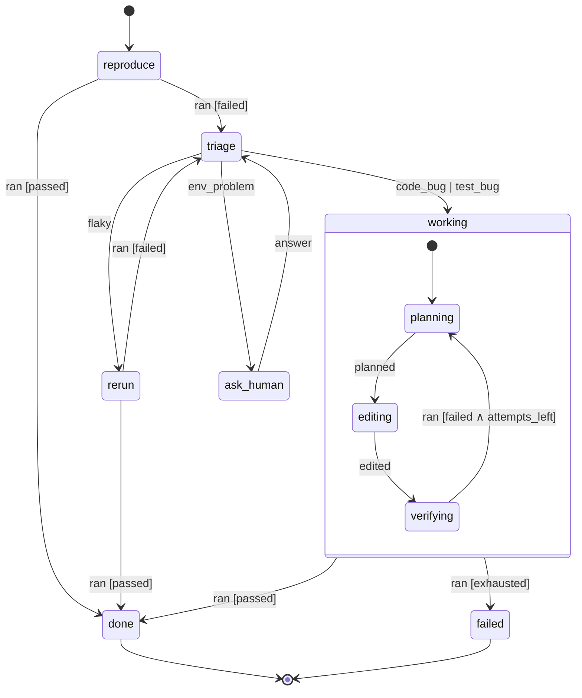
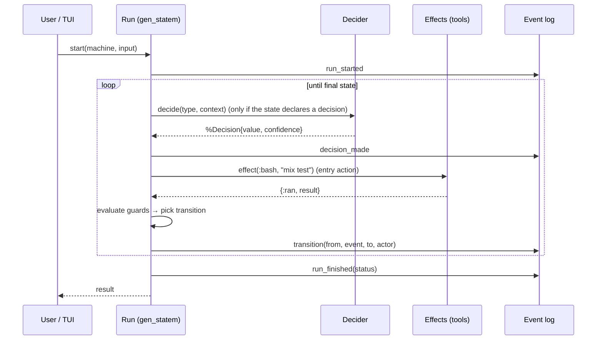

# 02 · State-machine core

[← Overview](00-overview.md) · Principles: [01](01-principles.md)

## Purpose

The core runs **machines**. A machine is a declarative, versioned statechart. The core gives each run its own supervised process, enforces guards, calls deciders, and emits one event per transition.

## Model: statecharts, executed by `gen_statem`

Xeito uses the Harel statechart vocabulary, the same one SCXML and XState use:

- **Hierarchical states.** `:working` contains `:planning`, `:editing` and `:verifying`. An event not handled in a child bubbles up to its parent.
- **Guards.** These are pure functions of `(state_data, event)`.
- **Entry/exit actions.** These are side effects, and they run only through *effects* (see below).
- **Timeouts.** These are the state, event and generic timeouts of `gen_statem`, and each one becomes a first-class `:timeout` event.
- **Final states.** Every machine has at least `:done` and `:failed`.
- **History and parallel regions.** Deferred until needed. Parallel regions are modelled as child runs instead (see "Composition").

The runtime is Erlang/OTP's `gen_statem` in `handle_event_function` mode. Xeito compiles a machine definition into a callback module, or interprets it through one generic module; an [open question](11-open-questions.md).
`gen_statem` already provides postponed events, state enter calls, timeouts and a fully inspectable state. That is most of a statechart runtime, already battle-tested.

### Machine definition (sketch, Elixir DSL)

```elixir
defmodule Xeito.Machines.FixFailingTest do
  use Xeito.Machine, version: "0.3.0"

  decision :triage, Xeito.Decisions.Triage          # typed, see 03

  initial :reproduce

  state :reproduce do
    on :ran, to: :triage,  guard: &failed?/2
    on :ran, to: :done,    guard: &passed?/2          # already green
  end

  state :triage do
    decide :triage                                  # emits {:decided, %Decision{}}
    on {:decided, :flaky},       to: :rerun
    on {:decided, :code_bug},    to: :working
    on {:decided, :test_bug},    to: :working
    on {:decided, :env_problem}, to: :ask_human
  end

  state :working, initial: :planning do
    state :planning  do on :planned, to: :editing end
    state :editing   do on :edited,  to: :verifying end
    state :verifying do
      on :ran, to: :done,     guard: &passed?/2
      on :ran, to: :planning, guard: &attempts_left?/2
      on :ran, to: :failed
    end
  end

  state :rerun     do on :ran, to: :done, guard: &passed?/2; on :ran, to: :triage end
  state :ask_human do on {:human, :answer}, to: :triage end
  final :done
  final :failed
end
```

The DSL compiles to plain data (`%Xeito.Machine{}`). That data can be exported as **SCXML** or as **Mermaid** for documentation, and as a **Petri net** for conformance checking ([05](05-event-log-and-process-mining.md)).



## Run lifecycle



## Effects are commands, not calls

Entry actions do not execute tools directly. They **return effect descriptions**, such as `{:effect, :bash, cmd: "mix test", timeout: 60_000}`, and an effect runner executes them.
When the runner finishes, it sends the result back to the run as an event.

This gives three properties for free:

1. **Replay.** In replay mode, the effect runner answers from the event log instead of executing anything, so a run can be stepped deterministically. See [06](06-observability.md).
2. **Sandboxing.** One choke point decides what is allowed. See [10](10-security-and-sandboxing.md).
3. **Testability.** Machines are tested with a fake runner. No mocks are needed inside the machine.

This is the "functional core, imperative shell" pattern, and the Elm / Redux-loop "commands" pattern, applied to agents.

## Composition

- **Sub-machines.** A state can `invoke` another machine. The child becomes a linked run whose final state arrives as an event in the parent (for example `{:child_done, :fix_test, result}`). This covers most "multi-agent" patterns without an agent framework.
- **Parallelism.** A parent invokes N children and waits for all of them (a guard counts completions). This is the natural fit for OTP: every child is a supervised process.
- **Machine registry.** Machines are identified by `{name, version}`. A run is pinned to the version it started with, so upgrades never change a running run.

## Supervision and durability

- `Xeito.RunSupervisor` (a `DynamicSupervisor`) starts one `gen_statem` per run.
- **Crash policy.** Every state declares `on_crash: :restart_state | :fail | :ask_human`. After a restart, the run rebuilds its data from the event log (event sourcing) and re-enters the current state.
- **Durable by construction.** Because the log holds every event, a machine that restarts after a reboot can resume where it stopped. Temporal offers this, but Temporal needs a server cluster; here it comes from a local append-only log.

## Invariants the core enforces

1. No transition happens without an event-log entry, written *before* the state change is acknowledged.
2. A decision can only produce values that label an outgoing transition of the current state. This is checked when the machine is compiled.
3. Every non-final state has a timeout, set explicitly or by default. No run waits forever.
4. Every machine has a reachable final state from every state. This is checked at compile time as a graph property.
5. Guards are pure. Enforcement is by convention plus a Credo check; the compiler cannot prove it.
