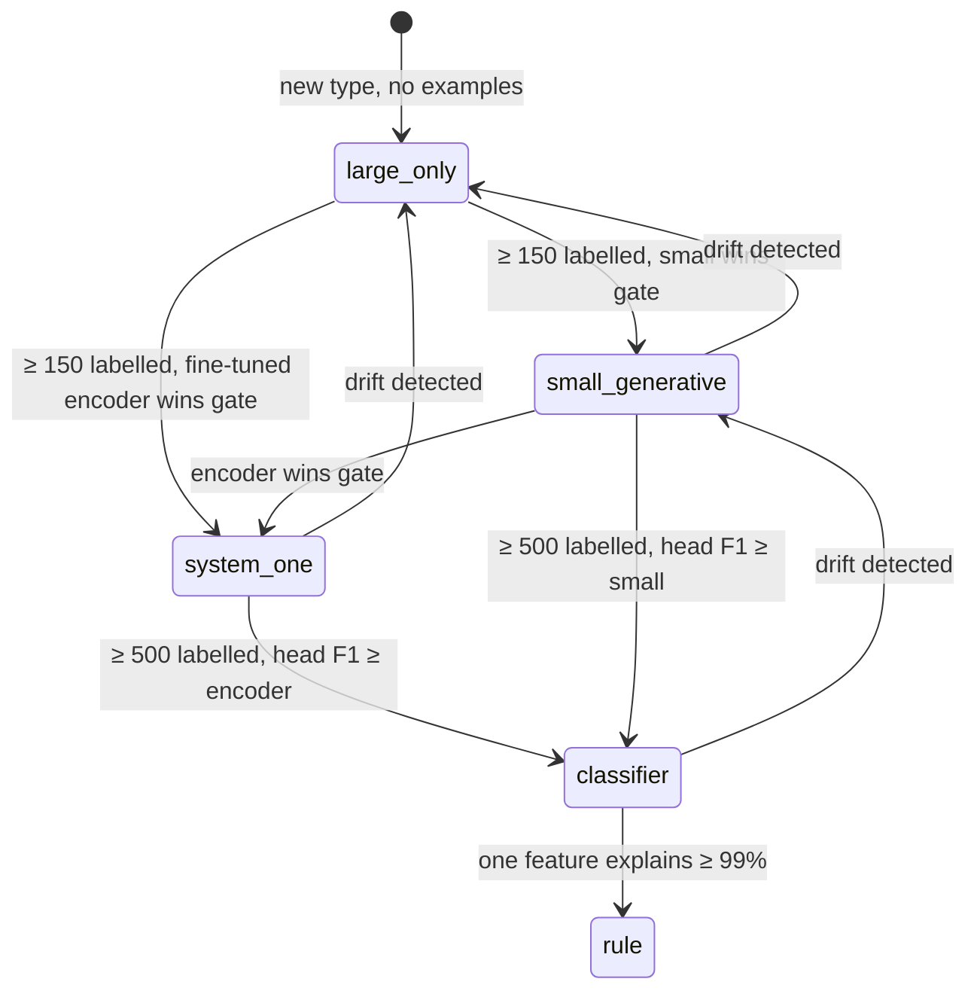

# 03 · Typed decisions

[← Overview](00-overview.md) · Uses: [02](02-state-machine-core.md) · Feeds: [04](04-delegation.md), [05](05-event-log-and-process-mining.md)

## The idea

Most of what an agent "does" is **choosing**: which tool, which file, is this done, is this safe, is this a flake.
Harnesses usually let the model make these choices implicitly in free-form text, and then parse the result.
Xeito makes every choice an explicit **typed decision**:

```
decision : Context → Decided(T) | Abstain(reason)
where T is a closed type, and Decided carries confidence, rationale and provenance
```

This borrows directly from **DMN (Decision Model and Notation)**, the OMG standard that treats business decisions as named, typed functions with declared inputs and outputs, separate from the process that invokes them. BPMN draws the process and DMN answers the questions inside it.
In Xeito, the statechart is the process and typed decisions are the questions.

## Decision type definition

```elixir
defmodule Xeito.Decisions.Triage do
  use Xeito.Decision

  @moduledoc "Why is this test failing?"

  input  :test_name,  :string
  input  :output,     :string, max_tokens: 1_500   # truncated deterministically
  input  :diff_stat,  :string

  output :value, enum: [:flaky, :code_bug, :test_bug, :env_problem]
  output :rationale, :string, max_length: 200
  # confidence is always added by the framework

  # Deterministic pre-rules, tried first (DMN-style decision table).
  rule "timeout with no assertion failure", when: &timeout_only?/1, then: :flaky
  rule "module not found",                  when: &missing_dep?/1,  then: :env_problem

  # Model policy, used only if no rule fires.
  deciders [:local_decision, :local]  # escalation ladder, see 04
  min_confidence local_decision: 0.80, local: 0.65
  examples "priv/decisions/triage/*.jsonl"   # few-shot and eval set
end
```

The decision record every decider produces:

```elixir
%Xeito.Decision{
  type:        Xeito.Decisions.Triage,
  type_version: "2",
  value:       :code_bug,
  confidence:  0.87,
  rationale:   "AssertionError on computed total; diff touches pricing.ex",
  actor:       :local_decision,        # :rule | a tier (:local, :remote, …) | :human
  model:       "qwen3-1.7b-q8_0",
  input_hash:  "sha256:…",             # cache + replay key
  latency_ms:  212,
  cost:        %{tokens_in: 830, tokens_out: 31, usd: 0.0},
  evidence:    [rule_misses: 2, alternatives: [test_bug: 0.09]]
}
```

## How type-safety is achieved

| Layer | Mechanism |
|---|---|
| **Decoding** | The output type is compiled to a **JSON Schema**, and from there to a grammar (llama.cpp GBNF / `json_schema`, Ollama `format`, or Anthropic tool-use input schema). The model *cannot* emit an invalid value. This is constrained decoding in the style of Outlines and XGrammar. |
| **Validation** | The output is parsed into an Elixir struct and validated again. The check is defensive, because not every backend enforces grammars. |
| **Compile-time** | Each value of `T` must label a transition in every state that uses the decision. Unhandled values are a compile error. |
| **Runtime typing** | Elixir's gradual set-theoretic types, as they mature, are used for `T` in the pattern matches of the machine. |

## Where confidence comes from

A model's self-reported confidence is poorly calibrated. Xeito combines up to three sources and records all of them:

1. **Token log-probabilities** of the chosen enum value, when the backend exposes them (llama.cpp does). For a closed enum, this gives a real distribution over the alternatives almost for free: one forward pass, then the probabilities of the first distinguishing tokens.
2. **Self-consistency.** Sample k times (k = 3–5) at temperature > 0 and take the agreement ratio. This is cheap on a small CPU model.
3. **Verbalised confidence.** A last resort, and never used alone.

**How the tiers compute confidence (P2):**
- *System One* returns a probability per option.
- *Small (llama-server)* uses **one-token scoring**. It renders the chat prompt, prefills `{"value": "`, requests one token with the top-50 logprobs, and renormalises the mass of tokens that start each option. If a token starts several options, it descends one token further.
- *Large (Ollama)* generates under the JSON schema and reads the logprobs at the first value token, renormalised the same way.

No tier asks the model for its confidence in words. Measured results: [bench 2](../../bench/2-decisions.md).

**Measured caveats (P0, [bench 0](../../bench/0-baseline.md)):**
- llama-server's `top_logprobs` come from the *unconstrained* distribution, so the top alternatives can be tokens the grammar forbids. Logprob confidence must be renormalised over the grammar-allowed first tokens of each option, or computed by scoring each option explicitly.
- Generating a rationale costs ~4× the decision itself on the CPU tier. Put `value` first in the schema, and make `rationale` optional and capped (off by default for the small tier).

Calibration is **per decision type and per model**. It is fitted offline against the labelled examples (temperature or isotonic scaling), and the thresholds in `min_confidence` are tuned from the mined logs. See [05](05-event-log-and-process-mining.md).

## Abstention is a value

Every decision type implicitly includes `Abstain(reason)`. A decider abstains when:

- its confidence is below the threshold,
- the input exceeds its context budget, or
- a guard on its output fails (for example, it named a file that does not exist).

The machine does not branch on `Abstain` directly. The decision runner turns it into an **escalation**, and the escalation is a state machine of its own ([04](04-delegation.md)).

## Caching and replay

Decisions are keyed by `(type, type_version, input_hash, decider)`.

- **Replay** ([06](06-observability.md)) answers from the log. It never calls a model.
- A **cache** (optional, per type) reuses a prior decision on identical input. It is enabled for idempotent classifications and disabled where freshness matters.
- **Counterfactual re-runs.** Replay a logged run but re-decide *one* decision type with a new model or prompt, then diff the resulting paths. This is the main evaluation tool.

## The decision catalogue (initial)

| Decision | Values | Typical decider |
|---|---|---|
| `Intent` | `:question, :edit, :run, :explain, :plan, :other` | rule → small |
| `ToolChoice` | one of the enabled tools \| `:none` | small |
| `FileRelevance` | `:relevant, :maybe, :irrelevant` (per file) | small, in batches |
| `Triage` | `:flaky, :code_bug, :test_bug, :env_problem` | rule → small → large |
| `Done?` | `:done, :continue, :blocked` | rule (tests) → small |
| `Risk` | `:safe, :review, :forbidden` (for a proposed command) | rule → small; never remote |
| `Delegate?` | `:local, :large, :remote, :human` | rule + the calibration table |
| `PlanShape` | `:single_edit, :multi_file, :needs_research` | large |

## System One models: an external ecosystem to plug into (Sept 2026)

In September 2026 the typed-decision idea turned into a product category.
**Jev** (TypeSafe, launched 2026-09-15) is a hosted "System One" model. It has one endpoint, `POST /v1/systemone`, with three primitives:
- **Choice** among up to 255 options,
- **Score**,
- **Noul** (yes/no/abstain).

It returns calibrated, schema-valid decisions and generates no text. Within two weeks a set of open clones appeared: Laya, Kev, SemIf, GLiNER2.5-Decide and others (see [references §7](references.md#7-system-one-decision-models-jev-and-open-clones)).

This is external validation of Xeito's thesis. It also changes the design in three ways:

1. **Adopt the `/v1/systemone` contract as a decider backend interface.** A Xeito decision type compiles cleanly to it:
   - enum → `Choice`,
   - bounded numeric → `Score`,
   - boolean-with-abstain → `Noul`.

   Laya (`laya-serve`), Kev and other clones accept the same request body, so switching backends is a URL change. Xeito keeps its own richer `%Decision{}` record (actor, provenance, cost) around the call.
2. **Add a third decider family: non-autoregressive decision models.** These are encoders with option-scoring heads (Laya on ModernBERT/mmBERT, GLiNER2.5-Decide on DeBERTa). They sit between the generative small model and the trained classifier. They run on the CPU, cost tens to a few hundred ms, need no grammar, and score all options in one pass.
3. **Treat vendor numbers with suspicion, and gate on your own data.**
   - Base encoder checkpoints score *below the majority-class baseline* zero-shot on typed-decision suites (Laya 0.34–0.36).
   - Headline figures such as 0.766 or 77% come from fine-tuning on the benchmark's own training split.
   - Encoders become good only after fine-tuning on the target task *and* temperature calibration.

   This is exactly the graduation path below, and it is why the path starts with a large model and logged labels.

## Three families of small decider

- **Generative, grammar-constrained.** A 0.6–4B instruction model on CPU, prompted with the decision's docstring, its inputs and a few examples, and restricted by the grammar. It is flexible: a new decision type needs no training.
- **System One / option-scoring encoder.** laya-multilingual (mmBERT-base, 322M) or GLiNER2.5-multi-Decide (340M), served on the CPU behind `/v1/systemone`.
  - Zero-shot it is weak. After fine-tuning on logged large-model verdicts (the "stuntd" pattern) and temperature calibration, it is fast and consistent.
  - Known limits:
    - Accuracy drops beyond ~20 options (Banking77: 0.425).
    - Laya's language router mis-sends short German text to the English checkpoint, so **always pin `model="multilingual"` or `lang`**.
    - Low-resource languages are largely unevaluated.
- **Discriminative.** An embedding model plus a linear or logistic head trained on the logged decisions. It is extremely fast (under 10 ms), well calibrated and deterministic. A decision type **graduates** to this family once it has enough labelled history. This is the "demote to code" path from [01](01-principles.md#2-the-determinism-budget), one step short of a hand-written rule.

The graduation path of a decision type is itself a small state machine:



### The gate test

Every edge in the graduation machine uses the same pre-declared gate, as recommended by the Jev-alternatives research:

- **Compare three ways:** static rule vs the calibrated candidate vs the local large model.
- **Use 150–200 labelled decisions, not 50.** With 50, the confidence interval on accuracy is roughly ±14 points, too wide to separate close contenders.
- **Weight errors by cost.** The costs come from the decision type's declaration ([04](04-delegation.md#tuning-thresholds-from-the-log)).
- **Declare the winning margin in advance.** If the candidate does not clearly win, it is deleted and not kept around "just in case".

### What *not* to hand to a small decider

These cases are better decided by code, and so they are never graduation candidates:

- "Does this diff touch a public interface?" Use static analysis: route files, schema and migration diffs, public signatures, OpenAPI/GraphQL diffs. A classifier would add false negatives on exactly the case that matters.
- Budget and spend guards: numeric thresholds.
- "Is this PR ready?": CI results.
- **"May this content leave the box?"** Route by *source*, never by a classifier (see [10](10-security-and-sandboxing.md)).
