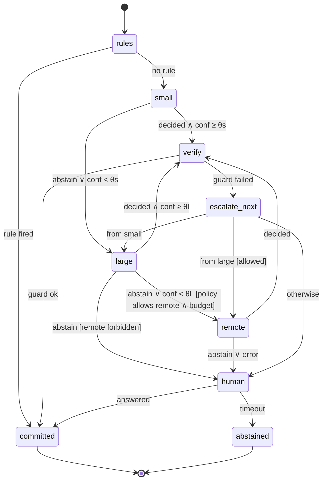
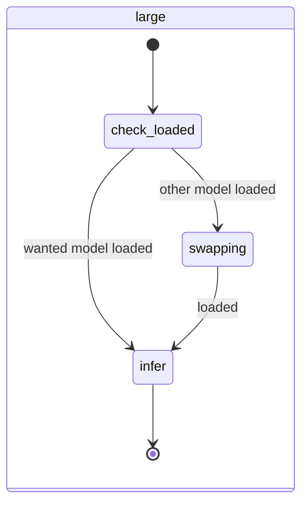

# 04 · Delegation as a state machine

[← Overview](00-overview.md) · Uses: [03](03-typed-decisions.md) · Deployed in: [09](09-reference-deployment.md)

## Yes: delegation *is* a state machine

"Ask the small model; if it's unsure, ask the big one; if that fails, ask the cloud or a human" is usually implemented as nested `try`/`if` blocks, and it disappears from view.
Seen through Xeito's lens, it is a machine with explicit states (who holds the decision), events (answer, abstain, timeout, verification result), guards (confidence thresholds, budgets, policy) and costs (latency, energy, money, data leaving the box).
Modelling it as a machine makes it **traceable** (which tier decided what), **tunable** (thresholds are data mined from logs) and **governable** (policy guards can forbid a tier for a decision type).

This is the model cascade / LLM-routing idea (FrugalGPT, RouteLLM) turned into a first-class, logged process.

## The escalation machine

One instance runs per decision request, as a child of the run ([02](02-state-machine-core.md#composition)).



| State | Meaning | Default timeout |
|---|---|---|
| `rules` | deterministic decision-table rules ([03](03-typed-decisions.md)) | 5 ms |
| `small` | CPU decider on the local box: a System One encoder (Laya via `laya-serve`) or a grammar-constrained small LLM ([03](03-typed-decisions.md#three-families-of-small-decider)) | 2 s |
| `large` | local GPU model (may involve a *model swap*, see below) | 60 s |
| `openrouter` | hosted open-weight model via OpenRouter, with logprobs ([below](#openrouter)) | 90 s |
| `remote` | external API (e.g. Claude) | 120 s |
| `human` | ask in the TUI; the run waits | configurable |
| `verify` | the guard on the decision's output (file exists, command parses, …) | 1 s |

### As implemented (P3)

`Xeito.Machines.Escalation` implements this as a regular machine: one child run per decision, logged in the same OCEL log with a `part_of` relation to the requesting run.
- **Routing.** The transitions live on the parent `deciding` state. Every tier's result bubbles up to one set of guarded transitions: commit, move to the next tier in the plan, or abstain.
- **The plan.** Rules first, then the permitted and configured tiers, then optionally a human. It is computed by `Xeito.Policy` before the run starts.
- **The remote tier** has no calibrated confidence (the API exposes no logprobs). When policy admits it, its result is terminal.
- **Measured** in [bench 3](../../bench/3-escalation.md).

### OpenRouter

`Xeito.Tiers.OpenRouter` (P3b) adds an **off-box tier with calibrated confidence**: hosted open-weight models through OpenRouter's OpenAI-compatible chat completions, with the decision's JSON Schema as `response_format` and `logprobs`/`top_logprobs`. Its confidence is computed exactly like the local large tier's, so it takes part in thresholds and cascades instead of being terminal.
- **Routing restrictions in every request.** `provider.require_parameters: true` (only endpoints that honour both the schema and logprobs), `data_collection: "deny"`, and `zdr: true` (zero data retention) by default. Providers can be pinned. Both filters rest on OpenRouter's knowledge of provider policies; they narrow the exposure, they do not make the tier local.
- **Same gate as `remote`.** `Xeito.Policy` treats `openrouter` and `remote` as *off-box tiers*: one `remote:` switch, the same locality rule (`:local_only` never leaves), the same per-run spend budget. `Risk` never reaches either, and `mix xeito.eval` skips them for types that forbid them.
- **Why Claude stays on the direct tier.** OpenRouter does offer an Anthropic-compatible Messages endpoint and passes `output_config` (effort, JSON-schema format) through, but not Anthropic's server-side refusal fallback. Claude returns no logprobs either way, and under `zdr: true` Claude requests are routed away from Anthropic's own endpoints to cloud endpoints where structured output is not uniformly supported. The direct Anthropic tier keeps all of this simpler.
- **Measured** in [bench 3b](../../bench/3b-openrouter.md).

**Placement awareness (Q16, decided).** In `check_loaded`, if the large model is not resident and an earlier small-tier answer has confidence ≥ `policy.unloaded_accept` (default 0.6), that answer is committed instead of paying for a swap. Measured: 0.55 s and ~36 J instead of 3.6 s and ~200 J. The price is accepting an answer the large model might not have endorsed.

## Guards on escalation

Escalation is guarded by **policy**, which is data and never a prompt:

```elixir
policy Xeito.Decisions.Risk,      remote: :forbidden          # never send commands to an API
policy Xeito.Decisions.PlanShape, remote: :allowed, max_usd_per_run: 0.50
policy :default, remote: :ask_first, max_large_swaps_per_run: 3
```

- **Data-locality guard: by source, not by classifier.** Inputs carry a provenance tag set when they are read: the workspace path, the tool, the skill. Examples: anything from mail, ticketing or wiki integrations, or from configured private paths, is `:local_only`.
  Such a decision cannot enter an off-box tier (`openrouter`, `remote`). Tiny classifiers are **not** used to judge "may this leave the box": independent tests found PII catch rates of ~16–23% for Laya and Kev ([references §7](references.md#7-system-one-decision-models-jev-and-open-clones)). Regex and NER scans only add defence in depth on top of the source tags.
- **Hosted decision APIs are `remote`.** A hosted System One model (Jev) is a remote tier like any other. It is allowed for synthetic, public or private-project data, and **never for `:local_only` data**. For public bodies, sending data to a cloud AI provider typically counts as processing on behalf under data-protection law, and a US provider is additionally subject to the CLOUD Act (see [10](10-security-and-sandboxing.md#data-protection)).
- **Budget guard.** A run carries a budget (money, wall-clock, GPU swaps). Once it is exhausted, escalation goes to `human`.
- **Idempotency.** A decision escalates at most once per tier. There are no loops. This is enforced by the machine's structure, not by counters.

## The cost of a tier change is a state

On the reference workstation, only one large model fits in ~24 GB of VRAM at a time (Ollama with one loaded model).
Switching from `qwen3.6:27b` to `gemma4:31b` is a **model swap** that costs seconds.
So `large` has substates:



`swapping` is logged like any other state. The swap cost therefore shows up in process mining, and the scheduler can batch large-tier decisions by model ("decide all pending `PlanShape` before swapping").

## Delegation of *work*, not only of decisions

The same machine shape covers handing a whole **sub-task** to a stronger agent. Examples: "have the remote model write this migration", or delegating to an external coding agent such as pi or Claude Code running headless.
The sub-task is an invoked child machine whose deciders are all one tier. It returns an artefact, and the parent verifies it with guards. The delegate sees only the context the parent explicitly passes. That context is logged, so it is auditable what left the box.

## Queues

Decision queues are **in-memory, per backend**: a process per decider backend with the capacity measured in [bench 1](../../bench/1-contention.md). They need no database.
Durability comes from the event log. A decision request is an effect (`effect_requested`), and one without a logged result is re-dispatched when a run recovers (at-least-once delivery, implemented in P1 for all effects).
A persistent job queue (Oban on PostgreSQL or SQLite) would duplicate the log and add a second source of truth.

## What gets recorded

Each escalation writes one event per state entered, including `from_tier`, `to_tier`, `reason` (`:low_confidence | :abstain | :guard_failed | :timeout | :policy`), the confidence that triggered it, and the cost incurred.
That is exactly what [05](05-event-log-and-process-mining.md) needs to answer:

- How often does `small` escalate for each decision type? → candidates for more examples or fine-tuning.
- How often does `large` *agree* with the `small` answer it overrode? → the threshold θs is too strict.
- How often does `verify` reject `remote`? → the remote prompt or context is poor.
- What does each type cost end-to-end? → a per-decision-type **cost-of-certainty** curve.

## Tuning thresholds from the log

P3 implements the held-out version of this: `Xeito.Decision.Eval.cascade/3` picks the lowest θ that keeps cascade accuracy within ε of large-only. On the P2 seed sets, Qwen-2B then decides 78% (done), 53% (intent) and 37% (triage) of cases without the large model, at unchanged accuracy ([bench 3](../../bench/3-escalation.md)). Writing tuned thresholds back into the types is P7.


The thresholds θs and θl are not constants. For each decision type, the tuner reads logged pairs (small's answer and confidence, the eventual committed answer) and picks θ to minimise:

```
E[cost] = P(escalate | θ) · cost(next tier) + P(wrong ∧ not escalated | θ) · cost(error)
```

The tuner reads `cost(error)` from each decision type's declaration: a wrong `Risk` decision is expensive, a wrong `FileRelevance` decision is cheap.
A threshold change is proposed as a machine update, and a human reviews it, like any other change coming from mining ([05](05-event-log-and-process-mining.md#the-meta-state-machine)).
