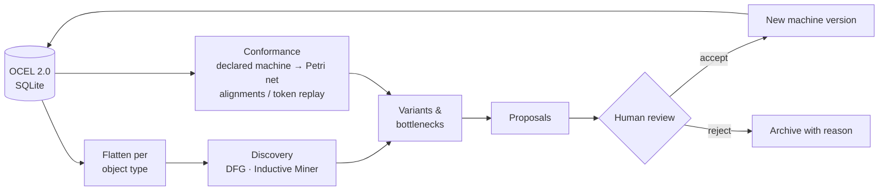
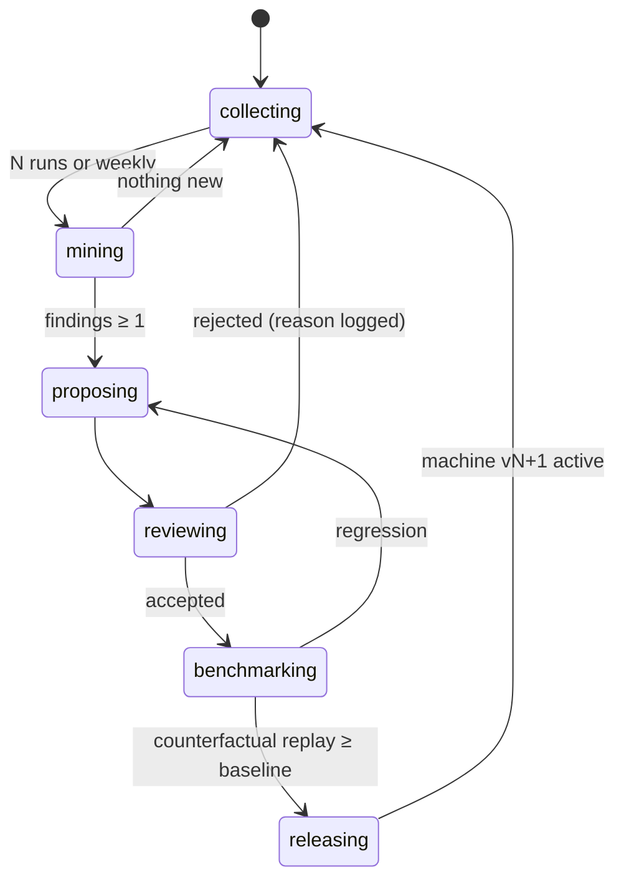
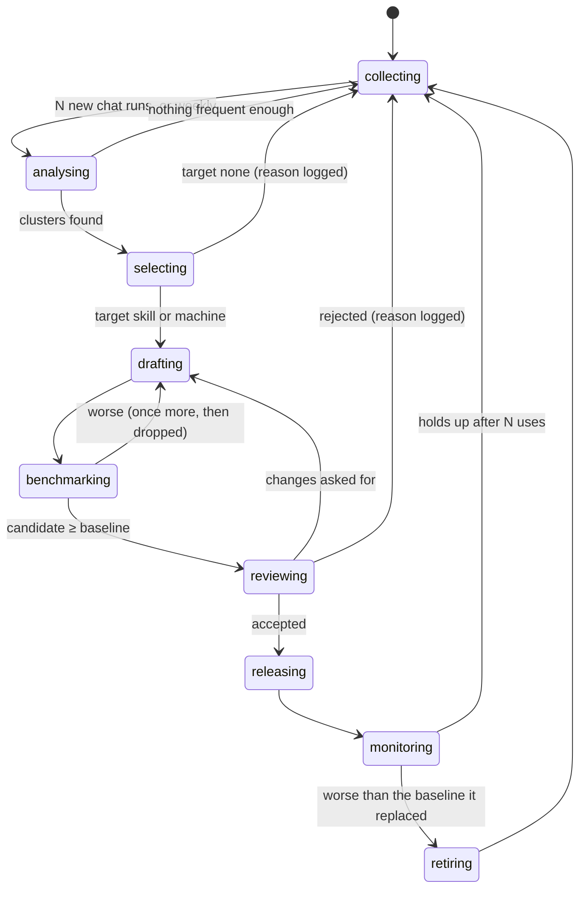

# 05 · Event log and process mining

[← Overview](00-overview.md) · Consumes: [02](02-state-machine-core.md), [03](03-typed-decisions.md), [04](04-delegation.md) · Feeds: [06](06-observability.md)

## Why process mining

Process mining extracts the **actual** process model from event logs, and compares it with the **intended** one (van der Aalst).
An agent harness produces exactly that kind of data: timestamped, case-structured events.
Xeito uses the discipline in two directions:

1. **Inward (meta).** Mine Xeito's own runs to see how machines really behave. Where do runs loop, stall, escalate or diverge from the declared statechart?
2. **Outward (product).** For any task the user brings, mine or sketch its process *before* automating it: "think about the task as a state machine first" ([01](01-principles.md)).

## Event log format: OCEL 2.0

A classic process-mining log (XES, IEEE 1849) assumes one *case* per event. Agent runs are not that simple.
A single `decision_made` event relates to a run, a decision, a model call and several files at once.
**OCEL 2.0** (Object-Centric Event Log) models this natively: each event references many objects of many types, and objects have their own attributes and relations.

### Object types

| Object type | Key attributes |
|---|---|
| `run` | machine, machine_version, input_hash, status |
| `machine` | name, version |
| `decision` | type, type_version, value, confidence, actor |
| `model_call` | tier, model, tokens_in/out, latency_ms, cost |
| `file` | path (hashed for private repos), language |
| `tool_call` | tool, exit_status, duration_ms |
| `user` | local id only |

### Event types

`run_started`, `state_entered`, `state_exited`, `decision_requested`, `decision_made`, `escalated`, `effect_requested`, `effect_completed`, `guard_rejected`, `human_prompted`, `human_answered`, `model_swapped`, `run_finished`.

Each event carries `(id, type, time, attributes, [{object_id, qualifier}])`, for example `{decision:42, "decides"}` and `{run:7, "within"}`.

### Storage

- **Hot:** an append-only log per run, kept in the Elixir node (ETS for the run, flushed to disk).
- **Durable:** **SQLite**, using the OCEL 2.0 SQLite relational layout, so PM4Py and other tools can read it directly. This means no export step, and a single file per workspace (`.xeito/log.sqlite`).
- **Optional:** export to OCEL JSON, flattened XES per object type, and OpenTelemetry spans ([06](06-observability.md)).

#### Storing inputs, not state

The log applies the central idea of fighting games' rollback netcode: the machines are deterministic, so the log records *inputs* once (model replies, tool output, human answers) and treats everything derived from them as recomputable. `Xeito.Log.Store` implements this without changing what readers see.

- **Message chains.** Each chat message is stored once in `xeito_message` and points to its parent. A message's id hashes its parent's id and its own content, so the id of a chain's last message is a checksum of the conversation up to it, and shared prefixes (system prompt, earlier turns) are stored once. Messages are stored as JSON, so any SQLite tool can read a conversation. A message that JSON cannot reproduce exactly also keeps its Erlang term. An event that carries a message list stores `{:xeito_chain, head, count}` instead. Its OCEL attribute shows `{"chain": head, "messages": count}`, so mining tools see the shape of a conversation without its text.
- **Results once.** The event that an effect's result produces refers to the `effect_completed` event instead of repeating its payload.
- **Compressed terms.** Terms are stored with compression, and small terms stay uncompressed.
- **Replay checks itself.** Like rollback's state checksums, recovery compares every effect the replay requests with the one the log recorded. For a chat call, that is the exact message chain the model saw. The first mismatch is reported as a desync, and the run refuses to recover from it instead of sending a different request. `mix xeito.log verify` runs this check over a whole log.

As a result, the log grows linearly with conversation length, not quadratically: in a synthetic chat run with 40 model calls, the payload drops from 1.4 MB to 49 KB. Logs written before this layout read unchanged, and `mix xeito.log compact` rewrites them.

## Mining pipeline

- **Discovery.** Directly-follows graphs (DFGs) for a quick look. Inductive Miner produces sound process trees and Petri nets. Object-centric DFGs across runs, decisions and model calls.
- **Conformance.** Each machine compiles to a Petri net ([02](02-state-machine-core.md)). Replaying the logged runs against it gives *fitness*, which should be 1.0 by construction since the core enforces transitions. Fitness below 1.0 means a bug or a hand-edited log.
  The more interesting measures are **precision** (does the declared machine allow many paths that never occur, so it could be simpler?) and conformance against *intended* models: the sketched process a user drew for a task, compared with what the agent did.
- **Performance.** Sojourn time per state, waiting time for effects, escalation frequency per decision type, rework loops (`verifying → planning` cycles), and model-swap overhead.
- **Decision mining.** For each decision type, learn which input features predict the committed value. This is how typed decisions graduate to classifiers or rules ([03](03-typed-decisions.md#three-families-of-small-decider)).

Tooling: **PM4Py** runs in a Python sidecar, invoked as a batch job over the SQLite file. It never sits in the hot path. Elixir-native DFG and variant computation cover the live inspector ([06](06-observability.md)). Nothing heavier is ported to Elixir.

## The meta state machine

The improvement process is a state machine, and it is logged like any other machine, so it is mined too:

### Kinds of proposal

| Finding | Proposal |
|---|---|
| A decision is always the same value given feature X | Replace it with a rule (raise the determinism budget) |
| `small` is overridden by `large` more than 30% of the time for a type | Add examples, raise θs, or fine-tune |
| `large` agrees with `small` more than 95% of the time when escalated | Lower θs (save cost) |
| A loop `verifying → planning` more than 3× is common | Add a `:rethink` state that escalates the plan |
| A state is never entered | Remove it (precision) |
| Frequent human override at a state | Make that state ask *before* acting |
| The model-swap state takes more than 20% of wall-clock | Batch decisions by model; change the default large model |

Proposals are **diffs to machine definitions or decision policies**, never to prompts alone. Each diff is benchmarked by counterfactual replay ([06](06-observability.md#4-benchmark)) before a human accepts it.

A later step (P7 in the [implementation plan](../implementation-plan.md)) lets the large or remote model *draft* proposals from mining output. Even then, the proposal goes through `reviewing`, and the drafting model is a decider in the meta machine like any other.

## Promotion: from free chat to skills and machines

The meta machine improves what already exists. New behaviour starts as free chat: a request with no dedicated machine goes to `Chat`, and the model works it out step by step. **Promotion** is the process that notices when the same kind of request keeps coming back, and turns it into something cheaper and more reliable. It is a state machine of its own, logged like any other.

### The ladder

Each rung adds structure, and each step up is earned from the log:

| Rung | What it is | Control flow | Cost per request |
|---|---|---|---|
| **Free chat** | the `Chat` machine with the general tools | the model decides every step | highest; varies most |
| **Skill** | a written procedure (`SKILL.md`, pi format) the model loads | the model, guided by the procedure | lower; varies less |
| **Machine** | a `Xeito.Machine` with typed decisions | fixed states and transitions; the model only where a decision is typed | lowest; deterministic where it can be |

A pattern usually climbs one rung at a time. A skill comes first, because it is cheap to write and to throw away. It becomes a machine once its runs follow the same steps. A pattern can also go down a rung: a release that does worse than what it replaced is retired.

### The process

1. **Collecting.** Every finished turn is already in the log: the prompt, the Intent decision, the route ("no dedicated machine for intent X"), every tool call and result, the outcome, tokens and time. Nothing extra is recorded for promotion.
2. **Analysing.** Each free-chat run (and each run of a released skill) gets a **trace signature**:
   - the Intent value;
   - its tool sequence, abstracted. A step is `read`, `edit` or `bash:<verb>` (`bash:mix test`, `bash:git diff`), and paths are reduced to their role (a test file, a source file, config);
   - its outcome: answered or failed, checks passed, reviews denied or answered with text, halted;
   - its cost: model turns, tokens, time.

   Runs are grouped twice: by prompt (embeddings, so "add a test for X" and "write tests for Y" meet) and by signature (exact variants, then a directly-follows graph per group). A **candidate** is a prompt cluster with at least N runs in the window, with its dominant variant and that variant's share.
3. **Selecting** (typed decision `PromotionTarget`: `skill`, `machine` or `none`), rules first:

   | Evidence | Target |
   |---|---|
   | Fewer than N runs, or cheap anyway | `none` |
   | Mostly failing, denied or halted | `none`. This is a bug report, not a candidate. |
   | Frequent, mostly successful, but no dominant variant | `skill`: the model needs guidance, not fixed steps |
   | Dominant variant ≥ 70%, a checkable end (an exit status, a test), and its branch points fit typed decisions with few values | `machine` |
   | A released skill whose runs now follow one variant | `machine` (the next rung) |

   Rules decide the clear cases. A model judges the rest and, as with Risk, may only make the verdict more cautious: `machine` → `skill` → `none`.
4. **Drafting.** A skill draft is a `SKILL.md`, written by a model from the cluster's best runs: their steps, the commands that worked, and the pitfalls that cost turns. A machine draft is a module whose states follow the dominant variant. Steps become states with effects, branch points become typed decisions, and the end check becomes the final transition. Each machine draft comes with a labelled example set for each new decision type, taken from the cluster's runs.
5. **Benchmarking.** The cluster's logged prompts are replayed on scratch copies of their workspaces, comparing the candidate with the route it would replace ([06](06-observability.md#4-benchmark)). Measured: success (the run's own check, or an acceptance check), model turns, tokens, time, and the determinism budget. A candidate goes forward only if it is at least as successful and cheaper.
6. **Reviewing.** A human sees the cluster (example prompts, the dominant variant), the draft as a diff, and the benchmark. They accept, ask for changes, or reject with a reason. Nothing is released without this step.
7. **Releasing.** A skill is written to the project's skills directory (or the user's), which is discovered on the next turn. A machine is registered, and the router sends its intent and hints to it.
8. **Monitoring.** After release, the new route's runs are compared with the baseline the benchmark promised: success, cost, how often a human overrides it, and conformance to its declared machine. If it holds up after N uses, the candidate is closed. If not, it is **retired**: the route is removed and the draft archived with the evidence, and requests go back down the ladder.

### What it logs

The process adds three object types to the log: **candidate** (a cluster with its signature and statistics), **proposal** (a draft with its benchmark) and **release** (what went live, and when). Each links to the runs it came from, so every skill and machine can answer *which requests produced me, and on what evidence*. The W3C PROV export ([P5](../implementation-plan.md#p5--ocel-export-and-process-mining-4-weeks)) carries that provenance outside.

### Gates

- **Every release passes a human.**
- **Every candidate beats its baseline** on replayed requests before review.
- **Promotion never touches Risk, Policy or Budget.** A new machine runs its commands through the same `Risk` decision as chat.
- The drafting model is a decider like any other: logged, replayable, and never the one that approves.

## Privacy

All mining is local. Before any object leaves the box (shared benchmarks, bug reports), file paths and code contents are hashed, and rationales are optionally redacted. The OCEL file is the unit of sharing, and it is scrubbed deterministically.
