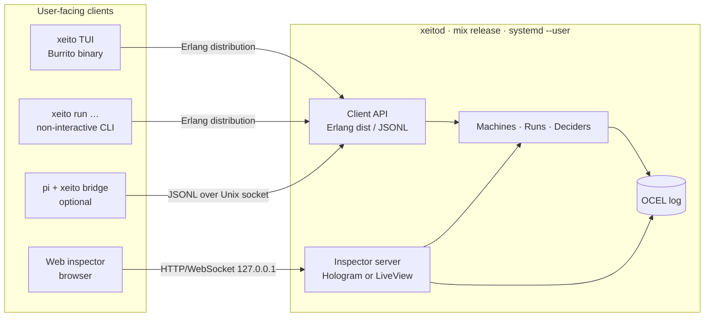
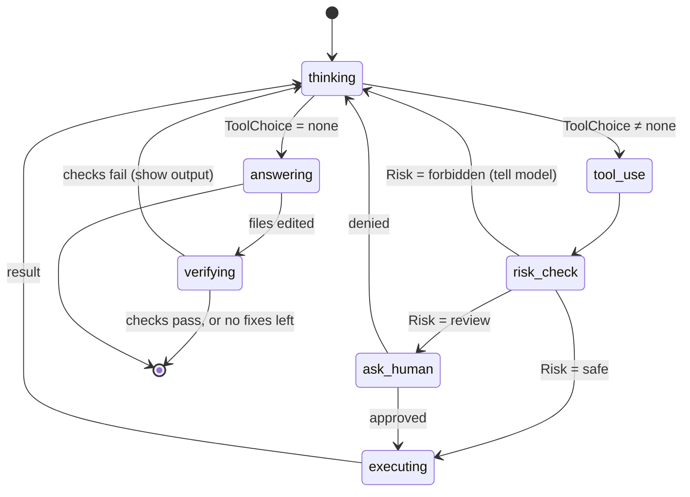

# 07 · Harness front end

[← Overview](00-overview.md) · Stack choices: [08](08-tech-stack.md) · Debug UI: [06](06-observability.md)

## Design goal: pi-like on the outside

The front end should feel like [pi](https://pi.dev): a terminal, a prompt, a short system prompt, four core tools, and nothing in the way.
Everything that makes Xeito different sits *behind* that surface. The user sees it only in a status line, and when they choose to step or inspect.

```
┌ xeito · ~/src/shop · fix_failing_test v0.3.0 ─────────────────────┐
│ > the checkout total test is red again                                    │
│                                                                           │
│ ◆ intent: edit (small 0.94)  → machine fix_failing_test                   │
│ ◆ reproduce   mix test test/checkout_test.exs … 1 failure                 │
│ ◆ triage: code_bug (small 0.87)                                           │
│ ◆ working/planning  (large qwen3.6:27b, swap 6.1s)                        │
│   … streaming plan …                                                      │
├───────────────────────────────────────────────────────────────────────────┤
│ state working/editing · tier large · 14.2s · CHF 0.00 · det 62%  [s]tep   │
└───────────────────────────────────────────────────────────────────────────┘
```

`det 62%` is the running determinism budget ([01](01-principles.md#2-the-determinism-budget)).

## Processes and clients



- **`xeitod`** holds all state: runs, the log and model clients. It is always on and survives when the TUI closes. Runs continue, and reattaching gives you the live run back. A TUI started in a directory continues that directory's last updated session (rebuilt from the log if the daemon restarted); `/sessions` lists the directory's sessions to switch to or start another, and Up/Down recall the prompts typed there (`Xeito.Session.Directory`). `/skills <words>` finds a skill by what it does (`Xeito.Skills.Index`).
- **`xeito`** is a thin TUI client. It crashes independently of the daemon, and the TUI library can be swapped without touching the core ([08](08-tech-stack.md#the-tui-the-weakest-link)).
- **JSONL client protocol.** One command or event per line. It is modelled after pi's RPC mode, so non-Elixir clients (the pi bridge, editor plugins, scripts) are trivial to write.

### As implemented (P4)

- **`xeitod`** is the application with `Xeito.Api` enabled (`mix xeito.daemon`; a release in P8). It listens on a Unix socket: `$XEITO_SOCKET`, or `~/.xeito/run/xeito.sock`. The directory is 0700 and the socket 0600, and nothing binds to a network address.
- **One protocol for every client.** JSON Lines over that socket (`Xeito.Api`). It carries requests (`start`, `attach`, `prompt`, `approve`, `deny`, `status`, `history`, `sessions`) and events: everything the session's runs log, plus the streamed `delta` text and session notices.
  The TUI uses it too, instead of Erlang distribution. That keeps a single client path, needs no cookies or epmd, and lets the TUI be replaced without touching the daemon.
- **Sessions** (`Xeito.Session`) hold the conversation. Each turn is a run `<session>/t<n>`, related `part_of` the session. The log is the workspace's own `.xeito/log.sqlite`, which gets its own `.gitignore`.
  `attach` with a `cwd` rebuilds a session the daemon no longer holds from that log.
- **Clients:**
  - `mix xeito.tui`: TermUI, Elm architecture. Daemon events reach it through the root's `handle_info/2`.
  - `mix xeito.chat`: line mode.
  - Both use `Xeito.Client.Render`, which folds escalation runs into their decision and indents delegated runs.
- **Delegation.** `fix_failing_test` with `delegate: true`, and `check`, hand the fix to a child run of the free chat machine (the `machine` effect). Machines compose without a second agent loop.
- **Skills** in pi's Agent Skills format are listed for the model and loaded on demand through a `skill` tool confined to the skill's directory. `/skill:name` forces one (`Xeito.Skills`).
- **Status bar** (TUI, Ctrl-T; segments with `/statusbar show|hide`, saved as a client preference in `Xeito.Client.Config`): git branch/dirty and the off-box budget from the session's `workspace` event, hardware and model services from `Xeito.Monitor`, which polls only while a client subscribes (the API's `monitor` command), plus session usage, the determinism budget, spend and queues, counted by the client from events (`Xeito.Client.StatusBar`). Transitions after a chat turn are attributed to the chat model's tier, so the budget reflects model-chosen paths.
- **Lifecycle.** Idle sessions close after 2 h and record `closed`, as do sessions stopped by a clean daemon shutdown. A workspace log closes after 30 min without calls and reopens on the next one. When a log opens, sessions still recorded `open` that no live process holds are marked `interrupted`. Retention is explicit (`mix xeito.log prune`, `Xeito.Log.Retention`), whole sessions at a time, and never touches `open` ones.
- **Why preferences are not a machine.** Showing or hiding a segment is one validated write, with no branching, no decision and nothing to audit. A machine would add ceremony and fill the log with trivial runs. Guided *multi-step* configuration (detect the tiers, test the endpoints, write the environment file) is a good fit for a machine, and is planned with the installer in P8.
- **`/machines`** and the API's `machines` command list the registered machines with version, summary, routing and usage in the workspace log (`Xeito.Session.Router.describe/2`).
- **Machines routed from `Intent`:** `fix_failing_test`, `commit`, `check`, `run_tests`, and otherwise free chat (`Xeito.Session.Router`).

## Interaction model

| User does | What happens |
|---|---|
| Types a free-form request | An `Intent` decision ([03](03-typed-decisions.md)) either selects a registered machine or falls back to the **free chat machine** |
| `/machine fix_failing_test` | Starts that machine directly (no intent decision) |
| `/step` or `s` | Toggles step mode ([06](06-observability.md#2-step)) |
| Answers a `human` state prompt | The answer is a typed decision with `actor: :human`, logged as a label |
| `/why` | Shows the last decisions with their confidence, tier and rationale |
| `/replay <run>` | Replays in the TUI; `/inspect` opens the web inspector at that run |
| `/budget 0.50` | Sets the run's remote-tier budget ([04](04-delegation.md#guards-on-escalation)) |
| `/step`, `/next`, `/decide <value>`, `/continue`, `/break …` | Step mode and breakpoints ([06](06-observability.md#2-step)); implemented in P4 |
| `y` / `n` | Approve or deny a command waiting in review (the TUI's shortcut for `/approve`, `/deny`) |
| Ctrl-J or `/steer <text>` | Puts the line into the running chat turn, for its next model call; implemented in P4 |
| A line while a turn runs | Queued in the session and sent when the turn ends normally; held otherwise (`/send`, `/drop`); implemented in P4 |
| `/undo [n]`, `/redo [n]` | Reverts the session's last n workspace changes, newest first, or puts them back (`Xeito.Undo`); implemented in P4 |

### The free chat machine: the escape hatch

Not every request has a machine yet. The free chat machine is pi's loop drawn as a statechart, and it is still logged and mined:



A turn that edited files ends only after a quick check has run (`verifying`: does it still build, e.g. format and compile warnings, in seconds; the full suite is the `check` machine's job), so the model's "done" is checked against the code that actually runs. `write` and `edit` refuse dependencies and build output (`deps/`, `_build/`, `node_modules/`) as well as `.git/` and `.xeito/`. Such edits never take effect, and a dogfood session lost two turns to one.

**Other projects.** The daemon serves any directory (`mix xeito.tui --cwd DIR`). How a project is tested and checked comes from its own task runner first (`Xeito.Session.TaskRunner`): a `justfile` recipe or a `mise.toml` task named `test`, `check` or `ci`, and `check-quick` (`just test`, `mise run check-quick`), when that runner is installed. Only without one does Xeito infer the commands from build files (`mix.exs`, `package.json`, `Cargo.toml`, …) or a Makefile. Commands also run with the project's own tool versions: the daemon starts in its own directory, so a command would otherwise get the daemon's Erlang, Ruby or Node. When mise is installed and the workspace or a directory above it has mise configuration, every command runs as `mise exec -- sh -c …` (`Xeito.Effects.MiseEnv`); a `mise.toml` mise does not trust yet is reported with `mise trust` as the fix.

Process mining of free chat runs is how **new skills and machines are discovered**. Frequent requests in the free-chat log are candidates for a skill, and those whose runs follow the same steps for a dedicated machine. Rule 6 in [01](01-principles.md) and the promotion process in [05](05-event-log-and-process-mining.md#promotion-from-free-chat-to-skills-and-machines) put this into practice.

## Tools (pi parity)

The core tools are the same four as pi: `read`, `write`, `edit`, `bash`. They are implemented as **effects** ([02](02-state-machine-core.md#effects-are-commands-not-calls)), so they are replayable and policy-checked.
Additional tools come from extensions. An extension is an Elixir module that implements `Xeito.Tool` and ships its own decision types and machines.

## Context and configuration

- `AGENTS.md` in the project root, the same convention as pi. It is injected into the chat prompts only; decision prompts are generated from decision definitions. Past 16 KiB it is cut, and the prompt says so.
- **The context window.** Ollama does not refuse a prompt that is longer than the model's window: it cuts it from the front, which drops the system prompt (and `AGENTS.md` in it) first, and reports no error. So the chat machine fits every request itself (`Xeito.Chat.Window`), into the large tier's `context` minus a reserve for the reply:
  1. old tool outputs become stubs, except the last four;
  2. the oldest earlier turns are dropped whole, with a note saying how many messages were left out (a turn starts at a user message, so a tool result never loses its call);
  3. the largest message of the current turn is shortened in the middle.

  The system prompt is set aside before any of this: one that does not fit on its own fails the turn with the reason, it is never cut. Tokens are estimated from characters, at a conservative 3 per token until the server's count of a request calibrates the ratio. Every large-tier request (chat, decisions, a model load) sends the same `num_ctx`, so the budget is the server's window by construction and the two kinds of request share one loaded model. As a last check, a prompt the server cut anyway is recognised by its size (half the window plus 1–3 tokens) and the session warns. All of it is a pure function of the run's context, so a replay sends the same requests.
- **Summaries of earlier turns** (P4c, chat machine 0.12.0). Dropping turns keeps a request within the window, but the session then forgets what they established. So before it gets that far, a turn whose earlier conversation takes more than 60% of the budget, or more than 40 messages, has its oldest whole turns summarised first (state `summarising`, after the skill is chosen): the local model writes a summary under fixed headings (goal; decisions and facts; files touched; open questions and next steps), folding in any summary so far, from a transcript of those turns fitted to the budget. The summary then stands in for them, for this turn and in the session's history, until the rest takes at most 30% and 20 messages. Neither fitting nor the session's own trim of its history ever drops it. It is a logged model call, so a replay reads it instead of asking again; it is not streamed to clients, which show `· summarising the earliest turns`. If the call fails, the turn goes on as before and fitting drops turns with the note.
- `.xeito/` in the project holds the event log (`log.sqlite`), project machines (`machines/*.ex`), and decision examples (`decisions/*/examples.jsonl`).
- `~/.config/xeito/config.exs` holds the tier endpoints, policies and budgets. For the reference values, see [09](09-reference-deployment.md).

## Web inspector

A local web app served by `xeitod` on `127.0.0.1:4040`. The views are specified in [06](06-observability.md#views-web-inspector), and the framework choice (Hologram vs LiveView) is in [08](08-tech-stack.md#decision-procedure).
From another machine, reach it through an SSH tunnel (local port forward of 4040) or a private VPN. It is never exposed on the LAN by default.

## pi bridge (optional)

A ~100-line pi extension, `pi-xeito`, that:

- registers `/xeito <machine>` as a pi command, which runs a Xeito machine through the JSONL socket and streams its events into pi's TUI;
- registers `xeito_decide` as a tool, so pi's model can ask Xeito for a typed decision (for example `Risk`) before acting.

This inverts nothing in pi: pi keeps its loop. It makes Xeito useful to pi users from day one, at almost no cost, and it is a natural way into the pi community.
