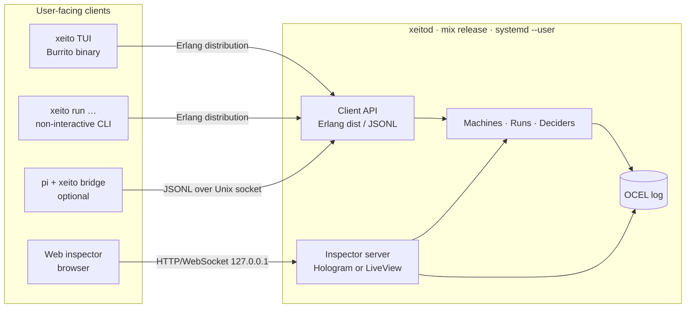
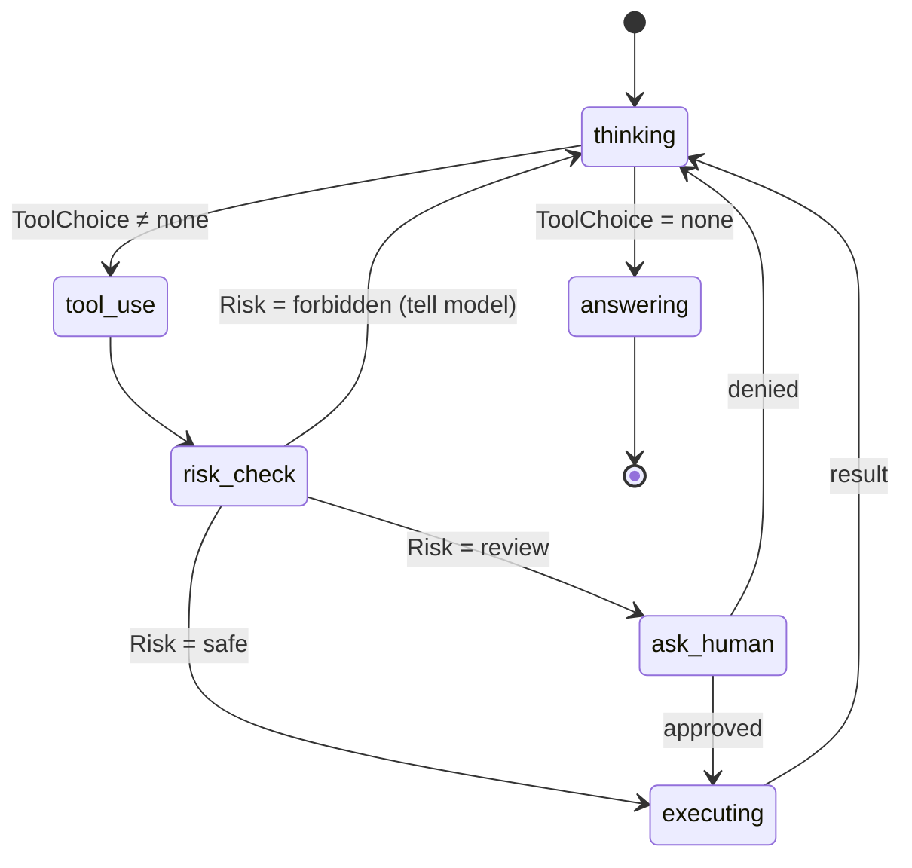

# 07 · Harness front end

[← Overview](00-overview.md) · Stack choices: [08](08-tech-stack.md) · Debug UI: [06](06-observability.md)

## Design goal: pi-like on the outside

The front end should feel like [pi](https://pi.dev): a terminal, a prompt, a short system prompt, four core tools, and nothing in the way.
Everything that makes Xeito different sits *behind* that surface. The user sees it only in a status line, and when they choose to step or inspect.

```
┌ xeito · ~/src/shop · fix_failing_test v0.3.0 ─────────────────────┐
│ > the checkout total test is red again                                    │
│                                                                           │
│ ◆ intent: edit (small 0.94)  → machine fix_failing_test                   │
│ ◆ reproduce   mix test test/checkout_test.exs … 1 failure                 │
│ ◆ triage: code_bug (small 0.87)                                           │
│ ◆ working/planning  (large qwen3.6:27b, swap 6.1s)                        │
│   … streaming plan …                                                      │
├───────────────────────────────────────────────────────────────────────────┤
│ state working/editing · tier large · 14.2s · CHF 0.00 · det 62%  [s]tep   │
└───────────────────────────────────────────────────────────────────────────┘
```

`det 62%` is the running determinism budget ([01](01-principles.md#2-the-determinism-budget)).

## Processes and clients



- **`xeitod`** holds all state: runs, the log and model clients. It is always on and survives when the TUI closes. Runs continue, and reattaching gives you the live run back.
- **`xeito`** is a thin TUI client. It crashes independently of the daemon, and the TUI library can be swapped without touching the core ([08](08-tech-stack.md#the-tui-the-weakest-link)).
- **JSONL client protocol.** One command or event per line. It is modelled after pi's RPC mode, so non-Elixir clients (the pi bridge, editor plugins, scripts) are trivial to write.

## Interaction model

| User does | What happens |
|---|---|
| Types a free-form request | An `Intent` decision ([03](03-typed-decisions.md)) either selects a registered machine or falls back to the **free chat machine** |
| `/machine fix_failing_test` | Starts that machine directly (no intent decision) |
| `/step` or `s` | Toggles step mode ([06](06-observability.md#2-step)) |
| Answers a `human` state prompt | The answer is a typed decision with `actor: :human`, logged as a label |
| `/why` | Shows the last decisions with their confidence, tier and rationale |
| `/replay <run>` | Replays in the TUI; `/inspect` opens the web inspector at that run |
| `/budget 0.50` | Sets the run's remote-tier budget ([04](04-delegation.md#guards-on-escalation)) |

### The free chat machine: the escape hatch

Not every request has a machine yet. The free chat machine is pi's loop drawn as a statechart, and it is still logged and mined:



Process mining of free chat runs is how **new machines are discovered**. Frequent variants in the free-chat log are candidates for a dedicated machine. Rule 6 in [01](01-principles.md) and the meta machine in [05](05-event-log-and-process-mining.md#the-meta-state-machine) put this into practice.

## Tools (pi parity)

The core tools are the same four as pi: `read`, `write`, `edit`, `bash`. They are implemented as **effects** ([02](02-state-machine-core.md#effects-are-commands-not-calls)), so they are replayable and policy-checked.
Additional tools come from extensions. An extension is an Elixir module that implements `Xeito.Tool` and ships its own decision types and machines.

## Context and configuration

- `AGENTS.md` in the project root, the same convention as pi. It is injected into prompts for the large and remote tiers only; small-tier prompts are generated from decision definitions.
- `.xeito/` in the project holds the event log (`log.sqlite`), project machines (`machines/*.ex`), and decision examples (`decisions/*/examples.jsonl`).
- `~/.config/xeito/config.exs` holds the tier endpoints, policies and budgets. For the reference values, see [09](09-reference-deployment.md).

## Web inspector

A local web app served by `xeitod` on `127.0.0.1:4040`. The views are specified in [06](06-observability.md#views-web-inspector), and the framework choice (Hologram vs LiveView) is in [08](08-tech-stack.md#decision-procedure).
From another machine, reach it through an SSH tunnel (local port forward of 4040) or a private VPN. It is never exposed on the LAN by default.

## pi bridge (optional)

A ~100-line pi extension, `pi-xeito`, that:

- registers `/xeito <machine>` as a pi command, which runs a Xeito machine through the JSONL socket and streams its events into pi's TUI;
- registers `xeito_decide` as a tool, so pi's model can ask Xeito for a typed decision (for example `Risk`) before acting.

This inverts nothing in pi: pi keeps its loop. It makes Xeito useful to pi users from day one, at almost no cost, and it is a natural way into the pi community.
