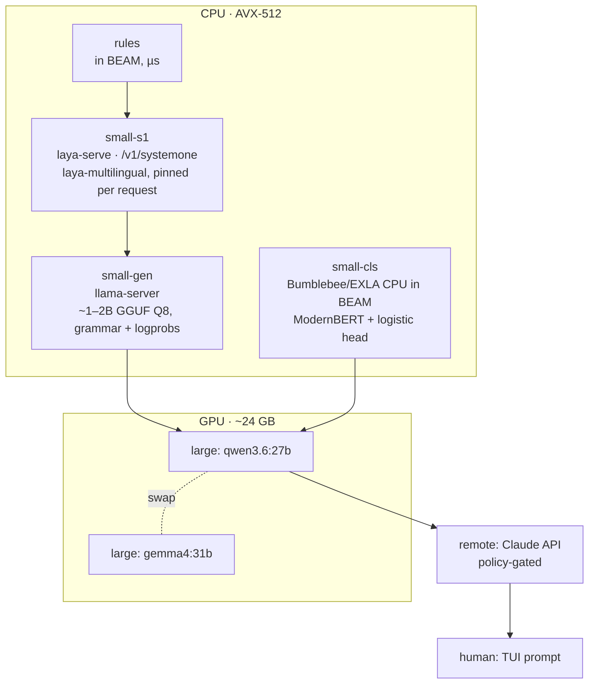

# 09 · Reference deployment: one workstation

[← Overview](00-overview.md) · Tiers: [04](04-delegation.md) · Decisions: [03](03-typed-decisions.md)

The reference deployment is a concrete, measured setup on a single workstation. It has two purposes: prove the ideas, and produce reproducible benchmark numbers.
Concrete host inventories and site configuration belong in each operator's private configuration, not in this repository.

## Hardware class

| Resource | Class | Why it matters |
|---|---|---|
| CPU | Recent 8-core desktop CPU with **AVX-512 (VNNI, BF16)**, e.g. AMD Zen 4 | int8/bf16 llama.cpp and ONNX inference run fast on the CPU, so the small tier needs no GPU |
| RAM | ≥ 64 GB | Several small models, a BEAM node and the page cache fit comfortably |
| GPU | Consumer GPU with **~24 GB VRAM** (AMD via ROCm/Vulkan, or NVIDIA) | Holds exactly one ~27–31B Q4 model at a time, with a large KV cache |
| Disk | NVMe, a few hundred GB free | Models and logs |
| OS | A recent Ubuntu-based Linux with systemd | User units for all services |

## Tier layout



### Tier: small (CPU)

#### small-s1: a System One decision model

- **What.** laya-multilingual (mmBERT-base, 322M, Apache-2.0), served by upstream **`laya-serve`**. It uses Laya's own CPU container (`compose.yaml` + `compose.http.yaml`, CPU PyTorch) and speaks the Jev-compatible `POST /v1/systemone` contract.
  - It is published on loopback only, with `LAYA_API_KEY_FILE` set, and runs as a non-root container user.
  - **Measured in P0:** 62–89 ms per warm request on the CPU ([bench 0](../../bench/0-baseline.md)). The latency does not change while the large model generates on the GPU ([bench 1](../../bench/1-contention.md)).
  - **Capacity:** `laya-serve` handles one request at a time, ~16 single-question decisions/s. Batch all questions for a state into one request instead of sending them concurrently. The first request after a start costs ~23 s for the checkpoint build, so warm it at startup.
  - The community `laya-onnx` port the research recommended (no PyTorch) was no longer available as of 2026-09-27. Other ONNX runtimes exist (Go, Rust, browser), but they are young. Upstream is the default until one of them proves itself.
- **Pinning.**
  - Always send `"model": "multilingual"` **in every request**. The server-side `LAYA_MODELS` setting does not stop the router from picking the English checkpoint (observed in P0). Laya's router sends ~64% of short German utterances to the English checkpoint, which costs ~20 points on MASSIVE-de.
  - Pin the container and model versions, because Laya shipped ~10 releases in two days.
  - Evaluate every language the deployment actually sees, low-resource ones in particular.
- **Why the CPU, not the GPU.** The large model already fills the VRAM. A decision model that wants the GPU would compete with it, and you can't load the large model just to decide whether to use the large model.
  ROCm support among the open clones is thin.
- **Zero-shot is not good enough.** The base checkpoint scores below the majority-class baseline on typed-decision suites. It becomes useful after:
  1. logging the large model's verdicts,
  2. fine-tuning locally on them (never on hosted notebooks with sensitive data),
  3. temperature calibration.
- **Second candidate:** GLiNER2.5-multi-Decide (340M, Apache-2.0, CPU-native). It needs a small adapter to the `/v1/systemone` contract.
- **Not recommended:** Kev-0.5B. It is a superseded prototype, English-trained, and only tested on Apple MPS.
- **Hosted Jev** (TypeSafe) is optional, for benchmarking only, on synthetic or public data. It is a `remote` tier and falls under the data-locality policy ([10](10-security-and-sandboxing.md#data-protection)).

#### small-gen: grammar-constrained small LLM

**Serving.** llama.cpp `llama-server`, built for the CPU with AVX-512 (`-DGGML_NATIVE=ON`). It runs as a systemd user unit pinned to most of the physical cores (for example 6 of 8), which leaves headroom for the BEAM, the TUI and the OS.
Its endpoints are `/completion` with `json_schema` or `grammar` plus `n_probs` for confidence ([03](03-typed-decisions.md#where-confidence-comes-from)). Where supported, `--parallel` with 2–4 slots handles concurrent decisions from parallel runs.

**P2 result:** the default CPU model is **Qwen3.5-2B-Q8_0** (intent 0.86, done 0.96 zero-shot, ~550–700 ms per decision). No small tier passed the gate, and with the large model loaded, the GPU tier is both more accurate and about as fast (~500 ms). The CPU tiers matter when the large model is not loaded, and after fine-tuning ([bench 2](../../bench/2-decisions.md)).

**Candidate models** (as evaluated in P2):

| Model | Size | Why a candidate |
|---|---|---|
| **Qwen3.5 0.8B / 2B** (Mar 2026) | 0.8B / 2B | The newest small Qwen models, built for on-device use. *Confirm GGUF quality.* |
| Qwen3 0.6B / 1.7B (2025) | 0.6B / 1.7B | Well-known baseline with many GGUFs available. |
| **Gemma 3 270M** / **FunctionGemma 270M** (Dec 2025) | 270M | Extremely fast. FunctionGemma is tuned for structured calls, which fits `ToolChoice`. |
| Granite 4.0 Nano 1B (Oct 2025) | 350M / 1B | Apache-2.0, has a hybrid-SSM variant. |
| LFM2.5-1.2B (Jan 2026) | 1.2B | Designed for edge devices. |
| Gemma 4 E2B (Apr 2026) | ~2B effective | Same family as the large-tier gemma4:31b. |

**Expected performance** (unverified estimates, scaled from published Zen 4 desktop benchmarks): for a 0.6–1B model at Q8, prompt processing runs at several hundred to more than 1,000 tok/s and generation at ~50–90 tok/s.
A typed decision is prompt-heavy and output-light. The **target is p50 below 400 ms and p95 below 1 s** per decision for a ~1B model. Prefix caching of the static decision preamble brings that down further.

**The classifier variant.** Bumblebee 0.8 runs ModernBERT and other encoders with EXLA's precompiled CPU backend, inside the BEAM. A decision type that has *graduated* ([03](03-typed-decisions.md#three-families-of-small-decider)) costs single-digit milliseconds and is deterministic.

### Tier: large (GPU)

- **Serving.** Ollama, with structured output via `format: <JSON Schema>`. The loaded model is read from `/api/ps`, which feeds the swap substate.
  - `qwen3.6:27b`: dense 27B, 256K native context, tuned for agentic coding. **Default large model** for planning and edit generation.
  - `gemma4:31b`: dense 31B, configurable thinking, function calling. Used as a *second opinion* for `verify` and for disagreement analysis.
- **Per-request options.** Xeito sends its own system prompt and options per request (low temperature, grammar). Custom Modelfiles are optional.
- **Swap cost.** With one model loaded at a time, a swap costs seconds. It is measured in P0 (cold load from NVMe into VRAM), and the scheduler batches large-tier requests per model ([04](04-delegation.md#the-cost-of-a-tier-change-is-a-state)).
- **llama.cpp on the GPU (benchmark only).** Reports from 2026 show llama.cpp's **Vulkan** backend beating ROCm on token generation on RDNA3 GPUs, while ROCm leads on prompt processing. Benchmark both next to Ollama. The tier client can target whichever wins.

### Tier: remote (optional)

- Anthropic Claude over the Messages API (raw `Req`), with JSON-schema structured output. The model ID is kept in config.
- Governed by policy ([04](04-delegation.md#guards-on-escalation)): `Risk` never goes remote, `:local_only` inputs never go remote, and each run has a budget.

### Tier: openrouter (optional)

- Hosted open-weight models through OpenRouter, with logprobs, so answers carry a calibrated confidence ([04](04-delegation.md#openrouter)). Useful for models too large for the local GPU, and for trying a model before downloading it.
- Configured by a key file and a model slug in the environment (`XEITO_OPENROUTER_*`, see `config/runtime.exs`). The key's limits can be checked for free (`GET /api/v1/key`).
- Off-box: the same policy gate, locality rule and budget as `remote`.

### Thread budget

The CPU placement of the small tiers costs the GPU-resident large model almost nothing: ≤ 4% of its tokens/s ([bench 1](../../bench/1-contention.md)). The host side of GPU generation still keeps ~5 hardware threads busy. Budget explicitly, and check with bench 1 after changing any tier:
large-tier host threads + small-tier threads + BEAM ≤ physical cores.
If the large model's context or size forces partial CPU offload, this budget no longer holds.

## Services

All services bind to **loopback only**. Remote access goes through an SSH tunnel or a private VPN, never through a LAN-exposed port.

| Unit (systemd `--user`) | Default bind | Notes |
|---|---|---|
| `ollama` | `127.0.0.1:11434` | Make sure Ollama is not bound to all interfaces. |
| `xeito-laya` (Docker, upstream `laya-serve`) | `127.0.0.1:8082` | Pinned upstream tag, API key file, `LAYA_PRELOAD=1`, model pinned per request |
| `xeito-llama-small` | `127.0.0.1:8081` | `llama-server -m <small>.gguf --threads 6 --ctx-size 8192 --parallel 4 --cache-reuse 256` (flags to be confirmed against the build) |
| `xeitod` | Unix socket under `$XDG_STATE_HOME/xeito/`, inspector on `127.0.0.1:4040` | `mix release`, `Restart=on-failure` |
| `xeito-mine.timer` | — | Nightly PM4Py batch over the project logs ([05](05-event-log-and-process-mining.md)) |
| `xeito-bench.timer` | — | Nightly benchmark, logged to `bench/` |

### Configuration sketch

```elixir
# $XDG_CONFIG_HOME/xeito/config.exs
import Config

config :xeito, :tiers,
  small_s1: [backend: :systemone, url: "http://127.0.0.1:8082",
             api_key: {:env, "LAYA_ONNX_API_KEY"}, model: "multilingual"],
  small: [backend: :llama_server, url: "http://127.0.0.1:8081", model: "qwen3.5-2b-q8_0"],
  small_cls: [backend: :bumblebee, device: :cpu],
  large: [backend: :ollama, url: "http://127.0.0.1:11434",
          models: [default: "qwen3.6:27b", second_opinion: "gemma4:31b"],
          swap_budget_per_run: 3],
  remote: [backend: :req_llm, provider: :anthropic, api_key: {:env, "ANTHROPIC_API_KEY"},
           default_budget_usd: 0.50, policy: :ask_first]

config :xeito, :energy, cpu: :rapl, gpu: {:sysfs, :auto}
```

## Benchmark protocol

It runs nightly, and on demand with `mix xeito.bench`. The results are committed as `bench/YYYY-MM-DD.json` plus a Markdown summary.
Host identifiers are reduced to the hardware class before committing.

1. **Hardware baseline (P0, then monthly).** `llama-bench` for each small candidate: prompt processing and generation at 512/2048 tokens, Q4_K_M vs Q8_0, and a sweep of thread counts. Record the cold-load and swap time for each large model. Compare llama.cpp CPU, Vulkan and ROCm with the same model.
2. **Decision quality (from P2).** For each decision type × decider: accuracy, macro-F1, calibration error (ECE), abstention rate, and latency p50/p95 on the labelled set.
   Use the **three-way gate**: rule vs calibrated small candidate vs local large model, with 150–200 labels and a pre-declared margin ([03](03-typed-decisions.md#the-gate-test)).
   Also run the public **JevBench** suite against every System One-compatible backend.
3. **Cascade efficiency (from P3).** For each decision type: the share decided per tier, accuracy vs large-only, cost, and **Joules per decision**. Energy comes from RAPL counters for the CPU and hwmon power readings for the GPU, sampled every 100 ms and integrated over each decision window.
4. **Process (from P5).** Success rate, mean path length, rework loops, and the determinism budget per machine, on a fixed task suite: 10 seeded repositories with known failures.
5. **Regression gate (P7).** Counterfactual replay of the candidate machine or model against the baseline. Any quality regression beyond the confidence interval blocks the release.

Rules: hold temperature and seeds fixed, avoid thermal throttling (log CPU temperature and clocks), use the same power profile, and record the software versions (llama.cpp commit, Ollama version, model SHA256).

**The headline chart** is *accuracy vs Joules per decision*, for three setups: large-only, small-only, and the cascade.
