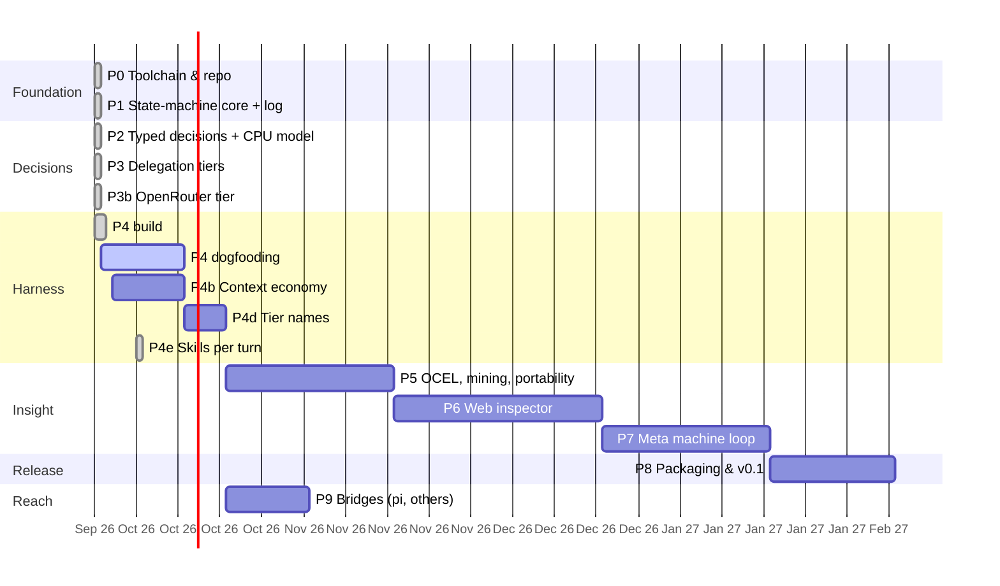

# Xeito — Implementation plan

Status: living plan, last updated 2026-09-30 (P0–P3b done; P4 built, dogfooding; P4b in progress) · Architecture: [architecture/00-overview.md](architecture/00-overview.md) · Design: [design.md](design.md)

## Guiding rules

- **A vertical slice first.** By the end of P2, a real machine runs on the reference workstation with a real typed decision, and it is logged. Everything else deepens that slice.
- **Every phase ends in something runnable and a written exit check.** No phase starts before the previous one's exit criteria are met, with the exception of work marked *parallel*.
- **Dogfood from P4.** Xeito's own development tasks become its first machines.
- **Rough sizing** assumes one developer working part-time, about 10–15 h/week. The durations are calendar weeks at that pace.

## Milestones

The original schedule assumed part-time pace from 2026-10-05. P0–P3 were built with agent assistance and finished well ahead of it, so the remaining phases are re-based on the actual dates. Their durations are unchanged. P4's exit needs two weeks of dogfooding, so it cannot close before 2026-10-12.

| Phase | Scope | Planned (original) | Effective / re-based | Evidence |
|---|---|---|---|---|
| P0 · Toolchain and repository | Elixir/OTP toolchain, CI, docs, guard hooks | 2026-10-05 → 10-19 | done 2026-09-27 | [bench 0](../bench/0-baseline.md), CI green |
| Bench 1 · contention (inserted) | CPU and GPU tiers under load | — | done 2026-09-27 | [bench 1](../bench/1-contention.md) |
| P1 · State-machine core and log | statecharts on `gen_statem`, effects as data, OCEL SQLite log, recovery | 2026-10-19 → 11-16 | done 2026-09-27 | 34 tests, property test |
| P2 · Typed decisions | decision types, rules, the CPU model, calibration, eval sets | 2026-11-16 → 12-14 | done 2026-09-27 | [bench 2](../bench/2-decisions.md) |
| P3 · Delegation tiers | escalation as a machine, the GPU tier, policy, budgets | 2026-12-14 → 2027-01-04 | done 2026-09-27 | [bench 3](../bench/3-escalation.md) |
| P3b · OpenRouter tier (inserted) | hosted open models as an off-box tier | — | done 2026-09-27 | [bench 3b](../bench/3b-openrouter.md) |
| P4 · TUI harness | daemon, TUI, chat and structured machines, step mode, skills, compact log, dogfood fixes | 2027-01-04 → 02-08 | built 2026-09-27 → 09-28; dogfooding until ≥ 2026-10-12 | [bench 4](../bench/4-harness.md) |
| P4b · Context economy (inserted) | shape tool output before the model reads it, elide old tool output from the conversation; measured with the code-navigation benchmark | — | ≈ 2026-09-30 → 10-12, within P4's dogfooding | [bench 4 §4](../bench/4-harness.md#4-code-navigation-outline-symbol-reads-and-the-project-map-2026-09-28) |
| P4c · Summarising dropped turns (planned) | a summarising step replaces dropped turns with a logged summary | — | after P4b | [07](architecture/07-harness-frontend.md#context-and-configuration) |
| P4d · Tier names | tiers named by kind and place (`local_decision`, `local`, `remote_decision`, `remote`, `remote_frontier`); backends separate; remote through OpenRouter | — | steps 1–2 done 2026-10-03; step 3 deferred | [P4d](#p4d--tier-names) |
| P4e · Skills per turn | the chat prompt lists the project's skills only; a typed decision picks at most one of the user's skills per turn | — | built 2026-10-04 | [P4e](#p4e--skills-chosen-per-turn) |
| P5 · OCEL export and process mining | OCEL validation, PM4Py sidecar, proposals (including token sinks), **promotion candidates** (frequent free-chat requests), **data portability** (decisions as training data, pi sessions, OTLP/CLEF, XES/PNML) | 2027-02-08 → 03-08 | ≈ 2026-10-12 → 11-09 | — |
| P6 · Web inspector | timeline, machine view, step debugger, decision relabelling (Hologram or LiveView) | 2027-03-08 → 04-12 | ≈ 2026-11-09 → 12-14 | — |
| P7 · Meta machine | mining-driven proposals, **promotion of skills and machines** (draft, benchmark, review, release, retire), counterfactual replay, graduating decisions, threshold tuning, **rollback-netcode ideas** (snapshots, prompt fingerprints, speculative decisions) | 2027-04-12 → 05-10 | ≈ 2026-12-14 → 2027-01-11 | — |
| P8 · Packaging and v0.1 | Burrito binary, install script or setup machine, guides, benchmark write-up | 2027-05-10 → 05-31 | ≈ 2027-01-11 → 02-01 | — |
| P9 · Bridges (added) | MCP server and client, ACP agent, `pi-xeito`, surveying and bridging other harnesses | — | after P4, alongside P5 (≈ 2 weeks) | — |

The original dates of P5–P8 follow the original chain of durations. The re-based dates assume part-time pace, and P9 runs alongside P5 rather than after P8, since it needs only the daemon's socket.

---

## P0 · Toolchain and repository (≈2 weeks)

1. On the reference workstation, install Erlang/OTP 29.1 and Elixir 1.20.4 via **mise** (or asdf). Pin the versions in `.tool-versions` ([08](architecture/08-tech-stack.md#versions-to-pin-in-p0)).
2. Create the umbrella-less Mix project `xeito` with these top-level namespaces: `Xeito.Machine`, `Xeito.Run`, `Xeito.Decision`, `Xeito.Effects`, `Xeito.Log`, `Xeito.Tiers`.
3. Set up CI (GitHub Actions or Forgejo): `mix format --check-formatted`, `mix credo --strict`, `mix dialyzer` (or the built-in type checker), and `mix test`. Since 2026-10-01 the formatter includes Styler, and `.credo.exs` disables the Credo checks Styler already rewrites ([08](architecture/08-tech-stack.md#code-style)).
4. Build **llama.cpp**: a CPU build with AVX-512 (the small tier), plus Vulkan and HIP/ROCm builds for benchmarking against Ollama only.
   Run `llama-server` as a systemd *user* unit on `127.0.0.1:8081` ([09](architecture/09-reference-deployment.md#services)).
5. Run upstream **`laya-serve`** (laya-multilingual) as a pinned Docker container on `127.0.0.1:8082` with an API key file, and measure its CPU latency.
6. Download 2–3 small GGUF models, the candidates from [09](architecture/09-reference-deployment.md#tier-small-cpu). Record the SHA256 of each file in `models.lock`.
7. Write `LICENSE` (Apache-2.0 recommended), `CONTRIBUTING.md` and a code of conduct.

**Status:** done 2026-09-27 (planned 2026-10-19). CI is green on GitHub; only the optional ROCm benchmark is pending. See [bench 0](../bench/0-baseline.md).

**Exit:** `mix test` is green in CI. `curl localhost:8081/completion` returns grammar-constrained JSON from a CPU model on the reference workstation. `llama-bench` numbers for each candidate are recorded in `bench/0-baseline.md`.

## P1 · State-machine core and event log (≈4 weeks)

1. Build the `Xeito.Machine` DSL, which compiles to a `%Machine{}` struct: states (hierarchical), events, guards, timeouts and finals ([02](architecture/02-state-machine-core.md)).
2. Add compile-time checks: every state reaches a final state, and every non-final state has a timeout. Verifying that decision values label transitions is stubbed until P2.
3. Implement the generic `Xeito.Run` (`gen_statem`, `handle_event_function`) that interprets a `%Machine{}`, plus `Xeito.RunSupervisor`.
4. Implement the effect runner with three tools, `read`, `write` and `bash`, and a fake runner for tests.
5. Implement `Xeito.Log`: an append-only writer to SQLite (via `exqlite`) using the OCEL 2.0 relational layout, with the event types from [05](architecture/05-event-log-and-process-mining.md#event-types).
6. Rebuild a run's state from the log after a crash (event sourcing).
7. Add exporters: Mermaid and SCXML from `%Machine{}`.
8. Write the first two machines, driven by code only with no model: `run_tests` and `fix_failing_test` (with a stubbed triage).

**Status:** done 2026-09-27 (planned 2026-11-16).
- The DSL compiles to validated data, and a pure engine is shared by `Xeito.Run` and `Xeito.Run.Recovery`.
- `Xeito.Log` writes OCEL 2.0 in SQLite. PM4Py reads it natively (`read_ocel2_sqlite`).
- Local, fake and `:none` effect runners exist; `mix xeito.export` produces Mermaid and SCXML.
- 34 tests pass, including a property test (up to 1,000 runs), kill/restart and in-flight-effect recovery.

**Exit:** a property test shows that, for random event sequences, the log alone reproduces the final state. Killing a run mid-way and restarting it resumes in the same state. The Mermaid export of `fix_failing_test` matches [02](architecture/02-state-machine-core.md).

## P2 · Typed decisions and the CPU model (≈4 weeks)

1. Build the `Xeito.Decision` DSL: inputs, closed output type, rules, deciders and thresholds ([03](architecture/03-typed-decisions.md)).
2. Build the schema compiler: output type → JSON Schema → a backend-specific constraint (llama.cpp `json_schema`/GBNF, Ollama `format`, Anthropic tool schema).
3. Implement two small-tier clients:
   - `Xeito.Tiers.SystemOne`, which calls `/v1/systemone` (`laya-serve` now; any Jev-compatible backend later). It always pins `"model": "multilingual"`.
   - `Xeito.Tiers.Small` (`Req` → llama-server), which returns the value plus **token log-probabilities** for the enum alternatives.
   Decision types compile to `Choice`/`Score`/`Noul` requests for the first client ([03](architecture/03-typed-decisions.md#system-one-models-an-external-ecosystem-to-plug-into-sept-2026)).
4. Compute confidence: logprob-based as the primary source, self-consistency with k=3 as a fallback. Record both.
5. Make abstention a value, and complete the compile-time check that decision values match transitions.
6. Build the first decision types: `Intent`, `Triage`, `Risk`, `Done?`. Hand-label **150–200** examples each, covering every language the deployment actually sees, into `priv/decisions/*/examples.jsonl`. Seed the examples from real `mix test` failures and from shell history.
7. Add the eval task `mix xeito.eval <Decision>` for accuracy, macro-F1, ECE and latency p50/p95 per model.
8. Run the **three-way gate test** (rule vs calibrated small candidate vs local large model, cost-weighted, with a pre-declared margin). Pick the default small decider per decision type, and delete the losers ([03](architecture/03-typed-decisions.md#the-gate-test)).
9. Log the large model's verdicts as training data for the local fine-tuning of laya-multilingual in P7.

**Status:** done 2026-09-27 (planned 2026-12-14), with an honest negative result. See [bench 2](../bench/2-decisions.md).
- Decision DSL, one-token logprob scoring, three tier clients, the decider ladder, `mix xeito.eval` and the gate are built.
- The seed sets are synthetic (45–128 per type).
- No small tier passed the zero-shot gate, so defaults are rules → large. The GPU-resident 27B model decides at ~500 ms with 0.93–0.99 accuracy.
- **Consequence for P3:** swap- and placement-aware routing (Q16) matters more than a fixed small→large cascade.

**Exit:** `fix_failing_test` runs end-to-end on a seeded failing repo, with `Triage` decided by the CPU model and logged with its confidence. The eval report for all four decision types is committed. `Risk` rules block the dangerous-command test set 100% of the time.

## P3 · Delegation tiers (≈3 weeks)

1. Implement the escalation machine ([04](architecture/04-delegation.md)), itself a `%Machine{}` running as a child run.
2. Add tier clients. `Large` uses the Ollama API on `:11434` with `format` = JSON Schema, detects which model is loaded (`/api/ps`), and models the swap substate. `Remote` uses ReqLLM (Anthropic) with tool-use schemas. `Human` asks through the TUI or a CLI prompt.
3. Add the policy DSL and guards for data locality, budgets and a maximum number of swaps.
4. Implement cost accounting per decision and per run: tokens, currency, wall-clock and estimated energy.
5. Batching: queue large-tier decisions per model so that swaps are avoided. Batch System One questions per state into one request, and give each backend a queue with its measured capacity ([bench 1](../bench/1-contention.md)).

**Status:** done 2026-09-27 (planned 2027-01-04). See [bench 3](../bench/3-escalation.md).
- The escalation machine runs as a logged child run, with swaps as states.
- Policy: remote off by default, local-only data never leaves the box, and Risk can never go remote (tested). Per-run budgets for spend and swaps; per-backend queues.
- Remote tier (stub-tested; no credentials on the reference box).
- Cost and estimated energy per decision and per run. Held-out threshold tuning.
- Exit measured: Qwen-2B takes 78% / 53% / 37% of done / intent / triage decisions at unchanged accuracy. `done` meets the <30% large-share target; intent and triage don't yet.

**Exit:** on the eval sets, the cascade (rules → small → large) matches or beats large-only accuracy while calling `large` for fewer than 30% of decisions (target to be confirmed in P2). The remote tier is provably never called for `Risk` (test). The swap state appears in the logs.

## P3b · OpenRouter tier (inserted, ≈1 week)

Inserted after P3. P2 showed that the small tiers need a stronger, calibrated tier behind them, and the local GPU holds one large model at a time. OpenRouter offers hosted open-weight models *with logprobs*, which the remote Claude tier cannot provide.

**Research (2026-09-27): what OpenRouter can and cannot replace.**

| Needed from the remote tier | Direct Anthropic | OpenRouter → Claude | OpenRouter → open-weight |
|---|---|---|---|
| JSON-schema output | yes | yes (require the parameter) | yes, per provider endpoint |
| Logprobs, i.e. calibrated confidence | no | no | yes, on selected endpoints |
| Effort / thinking off | yes | yes | where supported |
| Server-side refusal fallback | yes (beta) | no (only error-based model fallback) | same |
| Cost in the response | tokens only | `usage.cost` (USD) | `usage.cost` (USD) |
| No training / no retention | org terms | `zdr` routes Claude away from Anthropic's endpoints | `data_collection: "deny"`, `zdr: true` |
| Free health check | — | `GET /api/v1/key` | `GET /api/v1/key` |

**Decision:** keep Claude on the direct Anthropic tier, and add OpenRouter as a separate tier for open-weight models with logprobs.

1. `Xeito.Tiers.OpenRouter`: chat completions with the decision's JSON Schema (`strict`), temperature 0, reasoning off, `logprobs`. Every request sets `provider.require_parameters`, `data_collection: "deny"` and `zdr` (default on); providers can be pinned.
2. Confidence from `top_logprobs` at the value, shared with the local large tier. Endpoints without logprobs yield a terminal result. Refusals are errors. Cost from `usage.cost`; provenance names the serving provider.
3. Policy: `openrouter` and `remote` are *off-box tiers* under one gate (`remote:`), one locality rule and one spend budget. `Risk` never reaches either; `mix xeito.eval` skips them for types that forbid them.
4. An `openrouter` state in the escalation machine (v1.1.0), so the path is logged and mined like any other tier.
5. Configuration from the environment (`XEITO_OPENROUTER_KEY_FILE`, `_MODEL`, `_PROVIDERS`, `_ZDR`). A free key check (`key_info/1`).
6. Evaluation: `mix xeito.eval --deciders small,large,openrouter` reports `small→openrouter` next to `small→large`.

**Status:** done 2026-09-27. See [bench 3b](../bench/3b-openrouter.md).
- Hosted Qwen3.6-35B-A3B: 0.91–0.97 accuracy against 0.98–1.00 for the local 27B, ~0.45 s median, about $0.00003 per decision. Calibration is worse and does not improve with temperature scaling; pin a provider before fitting thresholds.
- Live: with public inputs and the large model unloaded, the ladder small → openrouter committed in 1.2–1.4 s without a swap, and the spend was charged to the run. Local-only inputs and Risk never reached it.

**Exit:** on the eval sets, the OpenRouter tier's accuracy and calibration are measured next to the local large model, with cost per decision. Off-box gating is tested for both off-box tiers. At least one live escalation reaches the `openrouter` state and is logged with its cost.

## P4 · TUI harness at pi parity (≈5 weeks)

1. Build a minimal terminal UI: an input box, a streaming transcript, a status line (machine / state / tier / cost) and a diff view.
   Use TermUI by default and spike ExRatatui if needed. The TUI is a separate Burrito binary talking to `xeitod` ([07](architecture/07-harness-frontend.md#processes-and-clients), [08](architecture/08-tech-stack.md#the-tui-the-weakest-link)).
2. Provide a **free chat machine**, the escape hatch: `idle → thinking → tool_use → idle`, with the large model deciding `ToolChoice`. This gives rough pi parity for unstructured use, and the machine is still logged.
3. Build machine selection from `Intent` (e.g. "the tests fail" → `fix_failing_test`).
4. Add step mode and breakpoints in the TUI ([06](architecture/06-observability.md#2-step)).
5. Support project context files (`AGENTS.md`), and read pi's skills directory format where feasible.
6. Add session save/resume, which comes for free from the log.
7. ~~Write the optional `pi-xeito` bridge extension~~, moved to [P9](#p9--bridges-to-other-harnesses-after-p4-2-weeks) on 2026-09-28.
8. **Dogfood.** Use Xeito for its own development for at least two weeks, and log the friction as issues.

**Status:** in progress since 2026-09-27. See [bench 4](../bench/4-harness.md).
- Done (items 1–6):
  - `xeitod` (`mix xeito.daemon`) with a JSONL client API on a private Unix socket.
  - The TUI (`mix xeito.tui`, TermUI) with transcript, edit diffs, status line (machine, state, tier, cost), reviews and step mode, plus a line-mode client (`mix xeito.chat`).
  - The free chat machine (tools as effects, `bash` behind `Risk`, reviews), machine selection from `Intent`, and delegation (`fix_failing_test` hands the fix to a chat child run).
  - Step mode and breakpoints, with human decisions logged as labels.
  - Per-workspace logs, and sessions that survive the client and are rebuilt from the log after a daemon restart.
  - A systemd user unit that puts the desktop first (`deploy/systemd/xeitod.service.example`): about 100 MB of RAM and no CPU when idle.
  - Idle sessions close after 2 h and resume transparently from the log. Budget entries are removed with their run or session, and a periodic sweep catches the rest.
  - [USAGE.md](../USAGE.md): setup, everyday examples, step mode, the log, evaluation, extending.
  - Skills in pi's format (Agent Skills, `SKILL.md`), read from the project's `.pi/skills` and `.agents/skills`, then `~/.pi/agent/skills` and `~/.agents/skills` (since 2026-10-03 only `.agents/skills`, the project's and the user's: Xeito does not read another harness's skill folders). They are listed for the model, loaded on demand through a `skill` tool confined to the skill's directory, and can be forced with `/skill:name`.
  - Structured machines: `run_tests`, `fix_failing_test`, `commit` (drafted message, human approval, fixed git commands) and `check` (the project's checks, with failures delegated to a chat run). With the free chat machine, that makes five.
  - `/machines` (summary, routing, per-project usage) and a toggleable TUI status bar: GPU, VRAM, power and temperatures, resident models and unload countdown, CPU and RAM, git branch/dirty, session usage, the determinism budget, spend, the off-box budget left, and queues. The daemon polls only while a client shows the bar. Segments are configurable (`/statusbar show|hide`) and saved as a client preference.
  - Lifecycle: session status in the log is truthful (`open`, `closed`, `interrupted`), idle workspace logs close and reopen transparently, and `mix xeito.log sessions|prune` gives explicit, whole-session retention (a dry run unless `--apply`).
  - Compact log (2026-09-28): chat messages are stored once as hash-linked chains of plain JSON rows, results are not repeated, terms are compressed, and replay checks each requested effect against the log (desync detection). A 40-call chat run's payload drops from 1.4 MB to 49 KB, and growth is linear instead of quadratic. `mix xeito.log stats|verify|compact`. See [05](architecture/05-event-log-and-process-mining.md#storing-inputs-not-state).
  - From dogfooding (2026-09-28):
    - A blinking prompt cursor. It is solid while typing and stops blinking after 10 s idle, so an idle TUI doesn't wake up.
    - `write`/`edit` refuse `deps/`, `_build/`, `node_modules/`, `.git/` and `.xeito/`. In the dogfood session, an edit to a dependency looked done but never took.
    - A quote-aware Risk tokenizer that treats read-only pipelines as safe. It decides 33 of that session's 35 commands by rule, where 13 were decided by rule before.
    - A project map in each chat turn's instructions (`Xeito.Source.RepoMap`): the project kind, top-level directories, modules with files (plus docs and public functions if they fit in 6,000 characters), and dependencies.
    - From a dogfood session (2026-10-01; chat machine 0.6.0):
      - Turns that stop at the step limit close with a tool-less summary turn.
      - "go ahead" and similar after an unfinished turn continue it, by rule and with tools. Tools are dropped only for small talk the rule detects, not whenever the model says `other`.
      - Exact repeat calls are not run again, and a model repeating its opening sentence gets a nudge.
      - Two steps in a row of failing calls end the turn, and an empty answer is noted.
      - `xargs` before a read-only command is read-only.
    - Sessions by directory (2026-10-03): a TUI started in a directory continues its last updated session, with its earlier turns from the log (each prompt, the first line of each answer, the last answer in full), instead of always opening a new one; `/sessions` lists the directory's sessions, last updated first, to switch to (`/sessions N`) or start another (`/sessions new`); Up/Down start with the prompts typed in the directory before. Every typed prompt is logged (`prompt_entered`); older sessions contribute their turns' requests (`Xeito.Session.Directory`).
    - A banner at the TUI's start (2026-10-04, begun by Xeito in a dogfood session): the keys, example prompts, the machines, the first lines of the workspace's `AGENTS.md`, and its skills by name, the user's own only counted.
    - Writing a test is not fixing one (2026-10-03): "write the failing test …", "add a red test", "test-first" go to chat, not `fix_failing_test`; and when `fix_failing_test` finds the tests passing, it says there is nothing to fix and how to ask for a new test, instead of an empty answer.
    - From a dogfood session (2026-10-03; chat machine 0.10.0): five turns in a row ended without an edit. Each re-read the same files, repeated one call, and was ended by the two-failing-steps rule before the model wrote anything; "WRITE NOW" only started the next such turn. Now a repeated call is answered with its earlier result (which may have been elided since), and the second failing step in a turn that has changed nothing gets one nudge to act, with tools, instead of ending the turn.
    - `read` gains `outline` (modules and functions with line ranges) and `symbol` (one definition by name) for Elixir files, and `write`/`edit` report a file that no longer parses in the same step (`Xeito.Source`, using Elixir's own parser). Other languages can follow through tree-sitter.
    - The chat machine (0.2.0) runs a quick check before answering a turn that edited files, and gives the model up to two tries to fix a failure. The check asks whether the code still builds (format and warnings for Mix, `cargo check`, `go build`, `tsc`), which takes about 0.5 s on this project. A `check.quick` alias or `check-quick` target overrides it.
  - Latency: `Intent` rules decide small talk and "run the tests" without a model, and small talk gets no tools, so its answer streams at once.
- Live: "the pricing test is failing, fix it" goes from Intent to a verified fix in 11 s.
- Live (2026-09-28): `/skill:py-inventory`, "run the checks and fix what fails" (a delegated fix, then the checks pass) and "commit these changes" (drafted, approved, committed) all work end to end.
- Exit latency: the median time to first token is **1.34 s** with the model warm (1.70 s before the Intent rules). Answers that start with a tool call still take 2.4–2.8 s, because Ollama holds back text while tools are offered. After the keep-alive has expired, the first reply adds ~2.5 s for the model reload. See [bench 4](../bench/4-harness.md).
- Open: dogfooding (item 8), which also measures the "five structured machines in daily use" criterion.
- Next, from dogfooding (planned 2026-10-02):
  - **Undo**, in three stages. A *step* is one effect that changed the workspace (`write`, `edit`, or a `bash` command whose snapshots differ); reads and commands that changed nothing are not steps.
    1. *Per-step snapshots and `/undo [n]` · `/redo [n]` inside the workspace* (done 2026-10-02, `Xeito.Undo`). Each changing effect is snapshotted before and after into a private git store, `.xeito/undo.git`, which never touches the project's HEAD, index or stash and works the same without git. `/undo n` reverts the session's last n steps, newest first, by applying each step's change in reverse to the workspace as it is now: what the user changed since stays, and a step whose lines the user changed is refused with nothing changed. The model is told what was undone. Files the project ignores, the protected directories, files over 5 MB (named by the step), and workspaces over 20,000 files are not captured. Retention: each session keeps at least its last 200 steps (trimmed in batches past 400), `mix xeito.log prune` drops the pruned sessions' steps, and the store is garbage-collected when the workspace log closes after being idle.
    2. *Git-aware undo, and named paths outside the workspace.* Done so far (2026-10-02): small ignored files (`.env`) are captured, ignored directories are not; undo and redo are logged as `step_undone`/`step_redone` events against the effect; the agent's commits on the current branch are undone by moving the branch back (compare-and-swap, the commits' files reset in the index), a pushed commit is refused with the `git revert` to run, and any other move of HEAD is left to git; files outside the workspace that a command names literally (`Risk.written_paths/1`, `~/` expanded) are backed up with the step and restored only while they are still as the step left them. Stage 2 is done. An unpushed commit by the agent is undone by moving the branch back, a pushed one only by a revert commit, which `/undo` offers instead. Small ignored files (`.env`) are captured, while bulky ones that can be rebuilt (`_build`, `deps`, `node_modules`) are not. Literal paths outside the workspace that Risk can name (`sed -i … ~/notes.txt`) are saved before the step. Undo and redo are logged as events: every undo is a label against the steps it reverts, for promotion and machine evals.
    3. *Undo lowers Risk where the snapshot covers the damage* (done 2026-10-03, as the Risk rule `undoable`; the review prompt's "undoable" label was left out, since a command still sent to review is by construction one undo cannot cover). Commands confined to the workspace but with paths Risk cannot prove today (globs, `find -delete`, `mv`/`sed -i` with options) become safe only when a snapshot was taken and checked before the step. Network, pushes, secrets and unknown programs are unchanged, because their danger lies outside the snapshot. The review prompt says "undoable" or "not undoable", and Risk logs `undoable` as an input, so the log shows whether lowered cases get undone more often. Start this only once the log shows stage 1 working in practice.
  - **A working marker** (done 2026-10-03). An animated marker in the status line whenever the session is not idle: a turn running, a decision being made, a model loading. It is distinct from *waiting for you* (a review or a paused step), which is highlighted and does not move, so idle, working and waiting are told apart at a glance. Like the cursor, the animation stops when nothing runs, so an idle TUI stays asleep.
  - **A cwd indicator** (done 2026-10-03; the full path left the header, where long ones were cut off). The session's workspace in the status line, shortened from the left (`~/…/xeito`), next to the git branch, so it is clear where commands run.
  - **Input while busy** (done 2026-10-03; `/send` and `/drop` act on a held queue; steering done the same day, on Ctrl-J and `/steer`, with internal transitions in the machine DSL). Before, Enter during a turn gets "busy", and the line comes back only through Up. Instead:
    - Commands for the running turn (`/halt`, `/approve`, `/why`, step mode) act at once, and text answers a waiting review, as now.
    - Any other line is *queued* in the session (in the daemon, so it survives a reattach and shows in every client), shown above the prompt, and logged as received while busy.
    - When the turn ends normally (`answered`) with nothing waiting for the user, the queued line is sent as the next prompt. When it ends halted, failed, at its step limit, or with a question to the user, the line is *held*: it was written without seeing that ending. "1 queued: Enter sends, Up edits, Esc drops".
    - A queued line is never taken as a review's answer: a review that appears meanwhile is answered explicitly.
    - *Steering*: Ctrl-J (Alt-Enter is reported as Esc then Enter by the terminal library) delivers a line into the running chat turn before its next model call, so a correction lands without halting (as in pi). The log then shows how often users queue or steer, which measures latency friction.
- Deviation from [07](architecture/07-harness-frontend.md): the TUI uses the same JSONL socket as every other client, not Erlang distribution.

**Exit:** a two-week dogfood log with ≥ 50 runs. At least five structured machines are in daily use. Median latency of `Intent` + first token is under 1.5 s on the reference workstation.

## P4b · Context economy (inserted, ≈1.5 weeks)

Added 2026-09-30, from the code-navigation benchmark ([bench 4 §4](../bench/4-harness.md#4-code-navigation-outline-symbol-reads-and-the-project-map-2026-09-28)). A chat run read about 500k input tokens and wrote about 3k: every step resends the whole conversation, including every earlier tool output. As in caveman's proxy, the gain is in what the model *reads*, not in how it writes. P4b runs during P4's dogfooding window, so dogfooding benefits as soon as it lands.

1. **Shape tool output before the model reads it** (`Xeito.Tools.Shape`, pure and deterministic):
   - Shell output: strip terminal escape codes, collapse repeated or near-identical lines (`… 37 similar lines`), keep the first and last lines.
   - Test and compile output (ExUnit, `mix compile` and similar, recognised by shape): keep failures, errors, warnings and the summary.
   - `grep`/`rg`: group matches by file, capped per file and in total. `find`/`ls`: capped.
   - Very large `read`s: return the outline and the first part, pointing to `symbol` or a line range.
   - Originals stay retrievable. Every result is already in the log, so shaped text ends with `[full output: read result "e12"]`, and `read` gains a `result` option.
   - The shaper is versioned. A replay then reproduces exactly what the model saw, and the desync check keeps working. This covers part of P7's prompt-build fingerprint.
2. **Elide old tool output from the conversation:**
   - Tool outputs older than the last few steps become one-line stubs, e.g. `[elided: output of grep -rn … (212 lines); re-run or read result "e7"]`.
   - The system prompt, the user's request, the model's own messages and the latest check output stay whole.
   - Stubs are applied in batches, every K steps. Changing an earlier message breaks the model's prompt cache from that point, and batching keeps that rare (the same slack as the history window's 80 → 60 trim).
   - A session's history applies the same stubs to earlier turns, which matters most for long multi-turn sessions.
3. **Measure** with the code-navigation benchmark (`bench/scripts/p4_code_nav.exs`), as variant D against C:
   - input tokens per run;
   - the step of the first edit;
   - runs that finish within the step limit and pass the quick check;
   - how often the model reads back an elided result. A high rate means the elision is too aggressive.

**Status:**
- Item 1 done 2026-09-30 (`Xeito.Tools.Shape`, applied in the effect runner, so the shaped text is logged next to the full output).
  - `read` gains `lines` and `result`.
  - On the tool outputs of the logged dogfood session, reads shrink by 59% (171k → 70k characters, mostly whole files of a dependency's source). Shell output shrinks by 10% (39k → 36k), because the model already pipes through `head`.
- Item 2 done 2026-09-30 (chat machine 0.3.0).
  - Tool outputs over 400 characters, except the last 4 and skill instructions, become stubs in batches of 6. Each stub names the call and its full effect id.
  - Only what is sent to the model is elided: the run's context and the session history keep everything.
  - The chat client sends Ollama only its own message fields.
- Item 3 done 2026-09-30, see [bench 4 §5](../bench/4-harness.md#5-p4b-tool-output-shaping-and-elision-benchmark-d-2026-09-30).
  - Input tokens per run fell by 62% (606k → 230k), and wall time roughly halved. The token half of the exit criterion is met.
  - The other half fails: no run with shaping reached an applied edit, against 3 of 3 without it. Shaped reads made the model page through files one step at a time.
4. **Follow-ups from benchmark D** (added 2026-09-30):
   - Shape reads by purpose rather than size: keep the project's own files whole up to a larger limit, and shape dependency sources and generated files.
   - Answer a missed edit with the nearest matching region and its line numbers.
   - Add a task-specific acceptance check to the benchmark, since compiling is a weak measure of success.
   - Then rerun benchmark D.
   - Status 2026-09-30: reads shaped by purpose and the nearest match on a missed edit are done (`0e0fddc`, [bench 4 §6](../bench/4-harness.md#6-p4b-follow-ups-benchmark-d-rerun-2026-09-30)).
     - Tokens −63%; runs with an applied edit 2 of 3 (0 of 3 before), against 3 of 3 without P4b.
     - Next: elision keeps the latest read of each project file whole, since the model re-read the stubbed file in slices. Then the benchmark's acceptance check and another rerun.
   - Status 2026-10-01: elision keeps the latest whole read of each of the last three project files read (chat machine 0.4.0, [bench 4 §7](../bench/4-harness.md#7-keeping-project-reads-whole-benchmark-d-rerun-2026-10-01)).
     - Tokens −47% against the project-map baseline; runs with an applied edit 3 of 3 (baseline 2 of 3); one run finished.
     - Remaining: the benchmark task is ambiguous ("prompt cursor": both finished runs blinked the `> ` marker), so the acceptance check comes with a reworded task. P4b exits once that check shows no loss of success with the savings.
   - Status 2026-10-01: the task is reworded and has a behavioural acceptance check ([bench 4 §8](../bench/4-harness.md#8-an-unambiguous-task-and-an-acceptance-check-benchmark-d-rerun-2026-10-01)).
     - Neither variant passes it within 25 steps (0 of 3 each), so "no loss of success" holds only trivially.
     - Tokens −44%; runs reaching an edit 2 of 3 against 1 of 3.
     - Both edited P4b runs stopped with code that does not compile. To make success measurable: the fix budget past the step limit, then dependency APIs in the map, or a larger step limit for the benchmark.
   - Status 2026-10-01: the fix budget is done (chat machine 0.5.0). A failing quick check gets up to two fixes, also at the step limit, with 4 model turns past `max_steps` shared between them.

5. **Fit every request into the context window** (added 2026-10-03, chat machine 0.9.0). Ollama cuts an over-long prompt from the front, silently, and the system prompt goes first. The chat machine now fits each request into the large tier's `context` (`XEITO_LARGE_CONTEXT`, also sent as `num_ctx`): stubs, then dropping the oldest earlier turns with a note, then shortening; the system prompt is never touched (`Xeito.Chat.Window`, property-tested and under mutation testing). Summarising instead of dropping is P4c.

Not in P4b (see [bench 4 §4](../bench/4-harness.md#4-code-navigation-outline-symbol-reads-and-the-project-map-2026-09-28)): a fix budget beyond the step limit, and dependency APIs in the project map. Both address task success rather than tokens and are separate harness fixes.

**Exit:** on the benchmark, input tokens per run are at least halved compared with variant C, with no fewer runs reaching an edit. Shaping and elision are covered by tests, including replay: a recovered run reproduces the shaped and elided messages exactly.

## P4c · Summarising dropped turns (planned)

Added 2026-10-03. Since chat machine 0.9.0, a chat request that does not fit the model's context window drops its oldest earlier turns, with a note ([07](architecture/07-harness-frontend.md#context-and-configuration)). That keeps the system prompt and the current turn intact, but a long session forgets what the dropped turns established. pi summarises instead: the dropped span becomes a structured summary that the model reads in its place.

1. **A summarising step in the chat machine.** When fitting would drop turns, the machine first enters a `summarising` state. Its entry is a `chat` effect without tools that asks the large model to summarise the span (goal, decisions, files touched, open questions), building on the previous summary if there is one.
   - The summary is a logged model call, so a replay reads it from the log instead of recomputing it: the request stays reproducible.
   - The summary replaces the dropped span and the note; it is kept in the session history, so later turns reuse it instead of summarising again.
   - It has its own budget: the span to summarise is itself fitted (stubs first), and the summary's length is capped.
2. **When it does not pay.** Summarising costs a model call of the span's size; on a 24 GB GPU that is minutes for ~50k tokens (measured with pi). The step runs only when the dropped span is large enough to matter, and falls back to the note when the summary call fails.
3. **Measure** on a long dogfood session: answers that need a dropped turn's facts, with the note against with the summary, and the time spent summarising.

**Exit:** a session that has dropped turns still answers questions about them, and replays reproduce its requests exactly.

## P4d · Tier names

Added 2026-10-03. The tiers grew one per backend: `system_one`, `small`, `large`, `openrouter` and `remote`. The names mix three things: the kind of model, where it runs, and the API it speaks. `openrouter` and `remote` are separate only because one speaks OpenAI's API and the other Anthropic's.

**Decision.** A tier is named by kind and place. The API it speaks is a *backend*, a setting of the tier.

| Tier | Kind | Was | Backend | Model |
|---|---|---|---|---|
| `local_decision` | System One decision model, local (Laya) | `system_one` | `system_one` | none, off until P7 |
| `local` | language model on the local GPU: chat and decisions | `large` | `ollama` | `qwen3.8:27b` |
| `remote_decision` | System One decision model, hosted (Jev) | — | `system_one` | unset |
| `remote` | hosted language model with logprobs, so its confidence is calibrated | `openrouter` | `openrouter` | unset; candidate `qwen/qwen3.8-27b` |
| `remote_frontier` | the strongest hosted language model; no logprobs, so its answer is final | `remote` | `openrouter` | unset; candidate `anthropic/claude-sonnet-5.5` |

- **System One models keep their own tiers.** They differ from language models in structure, role and use:
  - **Structure.** An encoder classifier takes the input and the options and returns a probability for each option. It generates no text.
  - **Role.** It decides and does nothing else: no chat, no explanation.
  - **Improvement.** It improves by training on labelled verdicts.

  The kind also exists in both places, local (Laya) and hosted (Jev).
- **The small language model tier (`small`, llama-server) goes.** No small model passed the P2 gate ([bench 2](../bench/2-decisions.md)), so every decision type runs on `deciders [:large]`. If the P7 fine-tuning produces one that passes, it comes back as a tier.
- **Remote means OpenRouter.** Both hosted language model tiers use the OpenRouter backend, and one key serves both. The direct Anthropic backend (`Xeito.Backends.Anthropic`) is removed. In P3b it was kept for Anthropic's server-side refusal fallback; going through OpenRouter loses that, and a refusal becomes an error that escalates to the human.
- **Remote tiers are opt-in, and off for now.** A remote tier has no default model. It exists only once its model and key file are both set; unset, it is not in any ladder, makes no requests and shows as not configured in the monitor. This matches operation today: every decision type runs on `deciders [:large]`, and the default policy forbids off-box tiers. Since 2026-10-03 the operator does not want remote tiers in operation, and after the rename none is configured.
- **Off-box is in the name.** Every `remote*` tier is off-box: under the policy's `remote:` gate, the locality rule (`:local_only` never leaves) and the spend budget. `Xeito.Policy` no longer keeps a separate list of off-box tiers.
- **Ladder order:** `local_decision` → `remote_decision` → `local` → `remote` → `remote_frontier` → human. Policy and configuration drop tiers from it, as now.

1. **Separate backends from tiers** (done 2026-10-03). The API a tier speaks is a backend in `Xeito.Backends`: `SystemOne`, `LlamaServer`, `Ollama` (decisions and model residency, formerly `Tiers.Large` and `Tiers.Ollama`), `OpenRouter` and `Anthropic`; the last two of these go in step 2. A tier's configuration may name its backend (`backend:`); without one, each tier keeps its old default, so nothing changes in operation. `Xeito.Tiers.run/4` dispatches by backend, an unknown backend is an error, and the monitor probes a tier through its backend's API. Nothing is renamed in this step.
2. **Rename** (done 2026-10-03). The rename covers:
   - the escalation machine (2.0.0, with states named after the tiers);
   - the `deciders` lists of the decision types;
   - `Xeito.Policy`, `Xeito.Tiers.Queue`, the energy estimates, `Xeito.Monitor` and the status bar;
   - `mix xeito.eval`: the P7 gate compares candidates against `local`.

   Settings become `XEITO_<TIER>_{BACKEND,URL,MODEL,KEY_FILE,CONTEXT}`, for example `XEITO_LOCAL_MODEL` and `XEITO_REMOTE_FRONTIER_MODEL`. A remote tier's backend and URL default to OpenRouter's; it is configured only when both its model and its key file are set, so one OpenRouter key does not switch both tiers on. The `llama-server` example unit, the `XEITO_LLAMA_*`/`XEITO_SMALL_MODEL` settings, and the llama-server and Anthropic backends go. The frontier tier asks OpenRouter for no logprobs, so endpoints without them (Claude's) can serve it. Old runs keep their machine version and their names: nothing in Xeito reads tier names back from old logs yet, so the old-to-new table is documented in [04](architecture/04-delegation.md#the-escalation-machine) for P5's readers rather than coded now.
3. **Choose the remote models (deferred until remote tiers are wanted).** A P3b-style benchmark on the eval sets measures accuracy, calibration, cost per decision and latency. It spends OpenRouter credit, so it runs only once remote tiers are to be used; until then the candidates below are notes, not defaults.
   - For `remote`: `qwen/qwen3.8-27b`, an off-box twin of `local` (12 of its 17 endpoints offered logprobs and JSON schema on 2026-10-03), against `z-ai/glm-5.3` and `moonshotai/kimi-k3`.
   - For `remote_frontier`: `anthropic/claude-sonnet-5.5` against `claude-opus-5.5`. The benchmark checks that structured output works under `zdr: true`, which routes Claude away from Anthropic's own endpoints.
   - For `remote_decision`: Jev is not callable through OpenRouter (checked 2026-10-03). `~typesafe/jev-latest` is listed with the modality `text->decisions` but has no endpoints. `typesafe/jev-router` is a router that uses Jev to choose a language model, which then answers in text. It returns no decision with probabilities, so it cannot serve this tier. The tier stays unset until Jev has an OpenRouter endpoint or a TypeSafe account is chosen; it would be the one remote tier not on OpenRouter.
4. **Later, a separate decision: chat on a remote tier.** Chat speaks Ollama's API only. A remote chat needs OpenAI-compatible tool calls, and a rule for which workspaces may leave the box at all.

**Exit:** the tiers carry the new names everywhere: configuration, logs, monitor, status bar and documentation. With no remote tier configured, nothing leaves the machine. In tests, a configured `remote` and `remote_frontier` are reached through OpenRouter, with costs logged. The live run and the benchmark of step 3 wait until remote tiers are wanted.

## P4e · Skills chosen per turn

Added 2026-10-04. Every chat request listed every skill Xeito could see, with its description, in the system prompt. Following the Agent Skills format, pi and Claude Code do the same. With a user skill library (about 50 skills), that came to about 8 KB, some 2,800 tokens, sent with every model call of a turn (9–15 calls), on a local model where every cache miss pays for the whole prompt again.

**Decision.** The project's own skills (`<workspace>/.agents/skills`) stay listed: they are few and always relevant. The user's skills (`~/.agents/skills`) are chosen per turn by a typed decision, so the chat model sees at most one of them.

1. **Shortlist by keyword** (`Xeito.Skills.rank/3`). The session scores the user's skills against the request: words shared with the skill's name count double, with its description once, common words not at all. The top three with at least two points are the candidates. This is deterministic, and no model is involved.
2. **Decide** (`Xeito.Decisions.Skill`). In the chat machine's first state, `choosing_skill`, which of the candidates, if any, the request needs: `first`, `second`, `third` or `none`. The decision type has a fixed set of values, while skills differ per directory, so the values are positions in the shortlist.
   - Rules decide first: no candidates means `none`, and a request that names a candidate picks it.
   - Otherwise the local model decides, with the request and the three descriptions in one short prompt.

   The decision is logged like any other, so P5 can mine it and P7 can graduate it to rules or to `local_decision`.
3. **Suggest.** The chosen skill goes into the turn's user message, after the request, as a hint to load it with the `skill` tool. It does not go into the system prompt, so the prompt's start (the model server's cache) does not change from turn to turn. Every skill can still be loaded by name, and `/skill:<name>` forces one as before (without a decision).

**Exit:** a chat prompt carries the project's skills and at most one user skill. The decision is logged in each chat turn; most turns decide by rule, without a model call. The skill type has labelled examples for `mix xeito.eval`.

## P4f · Finding skills by meaning

Added 2026-10-04. The P4e shortlist matches words: a request shortlists a skill only if they share two words. "summarise this youtube talk" finds no skill for transcripts, and "make my writing shorter" none described as "condense prose". You can only find a skill by guessing the words in its description.

**Decision.** Skills are found through an index that ranks by relevance and is widened towards meaning in layers, cheapest first. Each layer must improve a measured benchmark before the next one is built. The decision step of P4e stays as it is: the index only produces a better shortlist. Nothing is added to the chat prompt.

1. **Benchmark first** (done 2026-10-04, `Xeito.Skills.Bench`). `mix xeito.skills.bench [set.jsonl] [--skills DIR]` measures the shortlist (`Xeito.Skills.shortlist/2`). Each line pairs a request with the skill it needs, or with `none`. The task reports:
   - recall at 1 and at 3, and each miss with what the shortlist held instead;
   - for `none` requests, how often the shortlist is empty, so the decision needs no model call;
   - the shortlist's time per request.

   The public repository ships a sample library of 12 skills with a set of 34 requests (`priv/skills/bench`); a set given without `--skills` runs against the user's skills. The operator's set, against their own library, is kept in the private companion repository. **Baseline**, the P4e ranker on the sample: top 1 and top 3 12/27 (44%), `none` 7/7, about 0.2 ms. Every miss is a request phrased without the skill's words ("make my writing shorter", "is this branch ready to merge?").
2. **A full-text index with normalised words** (done 2026-10-04, `Xeito.Skills.Index`). It replaces `rank/3`.
   - **The index.** An in-memory SQLite FTS5 table (`exqlite` is built with FTS5) holds each skill's name and description, ranked by BM25 with a name word worth more than a description word. Keywords and example requests join as columns in steps 3 and 4. Skill bodies are left out: measured on the operator's set, they found nothing more and took 15 ms instead of 2.
   - **Built per search.** The index is built for each search, about 2 ms for 51 skills, so an edited or new skill counts at once, with no hashes to keep. A resident index waits until step 4 has something worth caching.
   - **Normalising words.** The porter tokenizer finds a word's other forms ("testing" finds "test"), and diacritics are removed. One spelling map runs on both the index and the query, so British and American spellings meet (`-ise`/`-ize` and their forms, `-our`/`-or`). Stemming alone keeps `summarise` and `summarize` apart.
   - **The shortlist rule.** A skill is shortlisted if it shares two of the request's words, or one of its name's, and filler words are dropped from the request. Measured on the operator's set, keeping every match found 86% of the requests that need a skill, but gave 8 of 10 requests that need none a shortlist, and so a model call each turn; the rule finds 76% and keeps 6 of 10 empty. Steps 3–5 are to raise recall.
   - **Discovery for the user** (`Xeito.Tui.SkillSearch`). `/skills <words>` in the TUI lists the skills that match any of the words, the best first, with their descriptions; `/skills` alone lists them all. After `/skill:`, Tab completes the names that start with the typed text, then the skills it describes. When no word matches, a second FTS5 table with the trigram tokenizer finds fragments ("youtub"). It does not correct typos: a trigram query matches substrings only.
   - **Measured** with `mix xeito.skills.bench`: on the sample, 16/27 found (59%, from 44%), `none` 7/7; on the operator's set, 37/49 (76%, from 51%), `none` 6/10 (from 9/10). About 2 ms per request.
3. **Keywords** (done 2026-10-04, manual synonyms).
   - **In skill files.** A skill's frontmatter may carry `metadata: keywords:`, a list or comma-separated. Following the Agent Skills format, extra fields go under `metadata`, so the frontmatter parser learned that one nested level.
   - **For skills you can't edit.** For vendored skills, an overlay file of `name: word, word` lines adds keywords by skill name (`Xeito.Skills.overlay/1`). It is named by `XEITO_SKILL_KEYWORDS`; `mix xeito.skills.bench --keywords FILE` measures one. The operator keeps theirs in the private companion repository.
   - **Weight.** Keywords are a column of the index, weighted between the name and the description. A keyword word shortlists a skill on its own, as a name word does, so keywords must be specific, and each part of a hyphenated one too: "stress-test" offered a grilling skill to every request about tests.
   - **Measured** on the operator's set, with keywords for 26 of their skills: 45/49 found (92%, from 37/49), `none` 6/10 (unchanged). The keywords were written knowing the set, so this overstates what new requests will see; fresh requests are the fairer test.
4. **Example requests per skill** (doc2query). When a skill is indexed, the local model writes 10–20 requests it serves, in the user's words. They go into the index's examples column. This is where the index gains meaning, at no cost per turn.
   - **A cache.** Generated requests are cached in a file keyed by the skill's content hash and the model's digest, so the index is stable across restarts. Only changed skills are regenerated.
   - **Logged.** Generation is a logged model call, like any other.
   - **In the background, at low priority.** The index uses whatever is ready. A first run over about 50 skills takes some minutes on the local model. `mix xeito.skills index` runs it explicitly.
   - **Reviewable.** `mix xeito.skills examples <name>` shows what was generated, so a bad set can be spotted and regenerated.
5. **Embeddings, fused with BM25 (opt-in).**
   - **The model.** A small embedding model, served by Ollama on the CPU so it does not compete with the chat model for the GPU. It is configured by `XEITO_EMBEDDING_{URL,MODEL}`, and unset means off.
   - **The vectors.** One per skill, from its name, description, keywords and examples. They are cached by content hash and model digest, so an edited skill, a different model or new weights under the same tag re-embeds automatically. They are held in ETS and compared by cosine similarity in Elixir: at this size, no vector extension is needed.
   - **The shortlist.** Each turn embeds the request. The BM25 ranking and the similarity ranking are merged by reciprocal rank fusion. A skill enters the shortlist on a BM25 match or on a similarity above a threshold tuned with the benchmark.
   - **Fallback.** If the model is missing or Ollama is down, the shortlist uses BM25 alone and logs one line.
   - **The alternative.** Bumblebee in-process (as planned for P7's classifiers) would remove the Ollama dependency but bring in Nx and EXLA. It is kept for P7.
6. **A wider fallback.** When no skill passes the threshold, the decision is not skipped. A sibling decision type, `skill_wide`, sees the ten best fused matches by position (`1`…`10` or `none`), so its values stay a fixed set. It runs only when the benchmark shows that the right skill is often ranked 4th to 10th.
7. **Later: learning from use** (deferred). Requests for which a skill was chosen by `/skill:`, or chosen by the decision and then loaded, would add their words to that skill's index. The event log already holds them. This waits until there is enough history, and until a rule says which signals count.

**Exit:**
- On the operator's set, the right skill is in the shortlist (recall at 3) for at least 90% of requests that need one, up from the P4e baseline.
- "summarise this youtube talk" shortlists the transcript skill.
- Requests that need no skill mostly end in `none`.
- A turn takes at most 250 ms longer.
- The prompt is no larger than after P4e.
- `/skills <query>` finds a skill by meaning.

## P5 · OCEL export and process mining (≈4 weeks)

1. Validate the SQLite layout against the OCEL 2.0 spec, and add JSON export.
2. Build a Python sidecar (`tools/mining/`, managed by `uv`) using PM4Py: object-centric discovery, flattening, DFG, Inductive Miner, and alignments against the machines' Petri-net exports.
   - PM4Py is AGPL-3.0, so the sidecar stays a separate process, never linked into Xeito.
   - [pm4py-mcp](https://github.com/azizketata/pm4py-mcp) (reviewed 2026-10-02: AGPL-3.0, unmaintained) is a useful map of which PM4Py calls read and write OCEL 2.0, flatten it, and discover object-centric DFGs and Petri nets. It has no OCEL validation and no alignments against imported nets, though, so write the sidecar fresh rather than reuse it.
3. Build the Elixir side: native DFG and variants for the live views, and `mix xeito.mine` to run the sidecar and ingest its findings as structured records.
4. Implement the proposal generators from the table in [05](architecture/05-event-log-and-process-mining.md#kinds-of-proposal). Start with rule-based ones only. One of them ranks **token sinks**: which tools, commands and files fill the model's context most, from the logged results, with a suggested fix for each (added 2026-09-30, after caveman's `learn`).
5. Publish an anonymised sample log. This is useful for research partners and for grant evidence.
6. **Data portability** (added 2026-09-28): a single `mix xeito.export` that turns what Xeito learns into files other systems can use. Exports are local files you pull, and nothing is pushed by default.
   - **Redaction levels:** *structure* (no text, paths hashed; also what item 5 needs), *metadata*, and *full*. Off-box rules apply as for the tiers: data marked local-only never goes to an opt-in sink.
   - **Decisions as training data**, probably the most valuable export for other systems. Logged decisions with input, value, confidence, tier, cost and latency go out as JSONL (the `examples.jsonl` shape), a chat-style fine-tuning format, and Parquet/Hugging Face datasets. Human overrides from step mode are labels, and a human replacing a model decision is a preference pair (chosen vs rejected) for DPO-style training.
   - **Conversations:** pi session JSONL, whose entries point to their parent just like the log's message chains, so pi can resume a Xeito conversation. Also OpenAI-style message lists with tool calls, and Markdown transcripts. The message table is already plain JSON (2026-09-28), so SQLite tools, DuckDB and Datasette can read conversations without an export.
   - **Traces:** OTLP following OpenTelemetry's GenAI conventions (runs as traces, effects and decisions as spans, message text only when opted in), for Langfuse, Arize Phoenix, Jaeger or Grafana Tempo. CLEF (JSON Lines for Seq and `jq`) as the lighter option. A GELF sink only as an explicit opt-in, since it sends data off the machine. Deferred from the P4 compact log, 2026-09-28.
   - **Process mining:** OCEL 2.0 JSON/XML (item 1), flattened XES per object type for ProM, Disco, Apromore and Celonis, and the machines as PNML Petri nets for conformance checking in other tools.
   - **Machines:** SCXML (already exported) plus XState JSON. Importing SCXML is the other half: statecharts designed elsewhere could run as Xeito machines.
   - **Decision types:** a bundle of the output schema (already JSON Schema), the eval set and the calibrated thresholds, so another harness can reuse a decision type, for example through the P9 `xeito_decide` tool.
   - **Metrics:** cost, tokens, latency, estimated energy and the determinism budget per run as CSV/Parquet, and live OpenMetrics for Prometheus from the daemon's monitor.
   - **Standard envelopes and hashes** (added 2026-09-30):
     - Events in the daemon's stream and in exports use the [CloudEvents](https://cloudevents.io/) envelope (`id`, `source`, `type`, `time`, `subject`, `data`).
     - Exported hashes use [RFC 8785](https://www.rfc-editor.org/rfc/rfc8785) (JSON Canonicalization Scheme) with SHA-256, so any language can verify them: decision inputs, message chains, replay checks. The log's own ids stay as they are.
     - Optionally, new ids become time-ordered [RFC 9562](https://www.rfc-editor.org/rfc/rfc9562) UUIDv7.
   - **Provenance:** a [W3C PROV](https://www.w3.org/TR/prov-overview/) export (entities, activities, agents) that answers which run, decision, model or human produced a change. It is useful for audits, and PROV is a standard model that other tools read.
7. ✅ **Promotion candidates** (added and built 2026-10-02, `Xeito.Promotion`, prompts grouped by shared words for now; the first half of [promotion](architecture/05-event-log-and-process-mining.md#promotion-from-free-chat-to-skills-and-machines)): trace signatures for free-chat runs, prompt clusters, variants per cluster, and `mix xeito.candidates`, a report of the frequent requests with their dominant variant, success, cost and a rule-based `PromotionTarget`. No drafting yet: the report is reviewed by hand, and the first skills and machines are written from it.

**Exit:** a weekly mining report generated from the dogfood logs, with ≥ 3 actionable proposals. PM4Py loads `.xeito/log.sqlite` without conversion. A dogfood session exports to pi's session format and resumes in pi, and logged decisions export as a dataset that trains a classifier outside Xeito.

## P6 · Web inspector (≈5 weeks)

1. **Spike (1 week):** build the machine view in **Hologram** and, as a fallback, in **Phoenix LiveView**. Pick one using the criteria in [08](architecture/08-tech-stack.md#decision-procedure).
2. Build the views in the order given in [06](architecture/06-observability.md#views-web-inspector): timeline → machine view → step debugger → decision table → mining dashboard.
3. Relabelling a decision in the UI writes to the eval set, closing the labelling loop.
4. Bind the inspector to `127.0.0.1` only. Remote access goes through an SSH tunnel or a private VPN.
5. **Browser tests** (noted 2026-10-03). Test the views with the chosen framework's own tools (`Phoenix.LiveViewTest`, or Hologram's). Anthropic's `webapp-testing` skill (Playwright in Python, Apache-2.0) was considered; adopt it under the skill convention ([.agents/skills/README.md](../.agents/skills/README.md)) only if an end-to-end check in a real browser is needed that those tools cannot do.

**Exit:** a run started in the TUI can be watched, paused, stepped and replayed from the browser. A decision can be relabelled and shows up in the next `mix xeito.eval`.

## P7 · Meta machine: mining-driven improvement (≈4 weeks)

1. Implement the meta machine itself as a Xeito machine ([05](architecture/05-event-log-and-process-mining.md#the-meta-state-machine)).
2. Add counterfactual replay (`re-decide`, `re-machine`) as the benchmarking gate.
3. Add graduation of decision types: fine-tune and calibrate laya-multilingual locally on the logged verdicts (the "stuntd" pattern), then graduate to a classifier (Bumblebee embedding + logistic head) and on to a rule ([03](architecture/03-typed-decisions.md)).
4. Let the large or remote model draft proposals from the mining output. A human reviews every proposal.
5. Automate threshold tuning (θs, θl) per decision type ([04](architecture/04-delegation.md#tuning-thresholds-from-the-log)).
6. Extend replay with further ideas from rollback netcode (deferred from the P4 compact log, 2026-09-28; see [05](architecture/05-event-log-and-process-mining.md#storing-inputs-not-state)):
   - **Snapshots:** checkpoint a run's context every N events, so counterfactual replay and long recoveries start from a checkpoint instead of from the beginning. Snapshots are a disposable cache; the logged inputs remain the source of truth.
   - **A prompt-build fingerprint:** log a hash of the tool specs and prompt templates with each chat call, so a replay can tell "the machine is unchanged, but the prompt code changed" apart from a real desync.
   - **Speculative decisions:** let a cheap tier predict the next decision, start acting on it, and reconcile when the confirmed decision arrives, as rollback does with predicted inputs. Only confirmed decisions are logged. This is for latency, and needs read-only effects or effects that can be undone.
7. Implement **promotion** as a Xeito machine. Two additions from reviewing outside work (2026-10-02):
   - A fourth `PromotionTarget` value, **script**: a request whose runs come down to the same commands becomes a fixed command the runner executes, without a model. The idea is from Anthropic's "code execution with MCP" article.
   - The **review step**, for promotion and the meta machine alike, after Microsoft's review-loop skill:
     - each review pass runs as a fresh child machine, so nothing carries over between passes;
     - findings are a typed decision on a closed severity scale (critical, high, medium, low), and critical and high ones are verified before a human sees them;
     - review lenses (security, adversarial, and so on) are a typed value;
     - a rule suggests stopping after two passes in a row with only low-severity findings, and the human decides.

   The machine itself ([05](architecture/05-event-log-and-process-mining.md#promotion-from-free-chat-to-skills-and-machines)), on top of the P5 candidates: `PromotionTarget` with a model behind the rules, drafting of skills and machines, benchmarking by replaying the cluster's requests, human review, release, monitoring and retirement. Exit addition: at least one skill and one machine promoted from the dogfood log, each beating its baseline.

**Exit:** at least one decision type has graduated to a classifier with equal or better F1. At least one machine revision was proposed by mining, accepted and benchmarked. The determinism budget of the dogfood machines has measurably increased since P4.

## P8 · Packaging, docs and v0.1 (≈3 weeks)

1. Package as a single-binary CLI (Burrito) plus `mix release` for the server mode.
2. Write an install script for Linux, with an Ubuntu-based recipe, llama.cpp setup and model download. Candidate: a `setup` **machine** for the guided part (detect the tiers, test each endpoint, write the environment file), since it has real states and checks.
3. Write documentation: a machine-authoring guide, a decision-authoring guide, and the benchmark protocol.
4. Write up the reference benchmark ([09](architecture/09-reference-deployment.md#benchmark-protocol)) as a blog post, with a talk proposal.
5. Tag v0.1.0.

**Exit:** a fresh Ubuntu-based machine goes from install to the first `fix_failing_test` run in under 15 minutes.

## P9 · Bridges to other harnesses (after P4; ≈2 weeks)

Added on 2026-09-28: bridges wait until the harness itself has been dogfooded.

1. **Standard protocols first** (added 2026-09-30), so one implementation reaches many harnesses:
   - An [MCP](https://modelcontextprotocol.io/) **server**: Xeito's machines and typed decisions become tools for Claude Code, pi, Cursor and other MCP clients. `xeito_decide` is one of them.
   - An MCP **client**: tools of configured MCP servers become effects, logged and gated by Risk and policy like `bash`.
   - An [ACP](https://agentclientprotocol.com/) (Agent Client Protocol) **agent**: editors that speak ACP, such as Zed, can drive `xeitod` directly. The TUI becomes one client among several.
   - API errors take the [RFC 9457](https://www.rfc-editor.org/rfc/rfc9457) Problem Details shape, so bridges handle them uniformly.
2. **`pi-xeito`**, the original P4.7 ([07](architecture/07-harness-frontend.md#pi-bridge-optional)): a small pi extension that registers `/xeito <machine>` and an `xeito_decide` tool, talking to the daemon's JSON Lines socket. It would be the only TypeScript in the project.
3. **Survey other agent harnesses** worth bridging, for example Odysseus AI and Jensen (to be researched; neither is evaluated yet). For each, note its extension or RPC surface, and whether its loop can call out to typed decisions or delegate to a machine.
4. Build the bridges the survey justifies. Each is a thin client of `Xeito.Api`, not a new code path in the daemon.
5. **A skill for building MCP tools** (noted 2026-10-03), before the MCP server: vendor Anthropic's `mcp-builder` skill (Apache-2.0) under the skill convention ([.agents/skills/README.md](../.agents/skills/README.md)). Keep its MCP design guide (tool naming, pagination, actionable errors) and its evaluation method (ten realistic questions answered through the tools); drop its Node and Python implementation guides and scripts, and point implementation at Elixir and `mix ci`. Test it with and without the skill, as `skill-authoring` describes.

**Exit:** at least one bridge drives a Xeito machine end to end from the other harness, and the run is logged like any other. The MCP server passes the protocol's own conformance checks (its inspector tool), and a decision is requested from another agent through it.

---

## Cross-cutting tracks (parallel)

| Track | When | What |
|---|---|---|
| Eval data | P2 → | Keep growing the labelled decisions. Every human override is a label. |
| Benchmarks | P0 → | Nightly `bench/` run on the reference workstation: hardware, models, decisions, machines. |
| Writing | P1 → | One short post per phase. It feeds the grant narratives and talks. Includes a mapping of Xeito's record-keeping and human oversight (the log, reviews, step mode, human decisions) to the EU AI Act (articles 12 and 14) and ISO/IEC 42001, for public-sector users. |
| Change risk | P4 → | Added 2026-10-01: a CRAP gate (max 30) on every test run, the pre-commit hook and CI. 16 older functions started in `test/crap_baseline.exs`, mostly untested TUI, API and rendering dispatch. Worked down to empty the same day, test-first (unit tests for the TUI, renderer, API connection, session commands, deciders' evaluation and log tasks; large dispatch functions split). The baseline stays as the mechanism, empty. Mutation testing (`mix xeito.mutate`) added the same day, starting with Risk: its first run left 49 of 140 mutants alive (among them, nothing pinned that a newline separates commands, without which a command after a safe one would pass as safe, nor the secret-file exclusions); after the new tests, none. Policy, Budget and the chat machine's guards followed (first runs: 67%, 44% and 35% killed; now all 100%, and one equivalent mutant was dead code in Policy, removed). The maximum went down to 6 on 2026-10-02, tests first: 72 functions were over 6; the 48 not fully covered got tests (which found that `mix xeito.chat` crashed instead of reporting a missing daemon), then the 37 still too complex were split, mostly dispatchers grouped by theme, with mutation testing at 100% throughout. |
| Secrets and personal data | P5 → | Added 2026-10-02, from Anthropic's "code execution with MCP" article: the effects runner replaces secrets and personal data in tool output with placeholders before it reaches a model, and puts the real values back when a command runs. Then a model can work with a value without seeing it. It matters most for the off-box tiers, alongside their policy gate ([10](architecture/10-security-and-sandboxing.md)). |
| Conformance | P5 → | Execution semantics against [W3C SCXML](https://www.w3.org/TR/scxml/) (added 2026-09-30). Xeito exports SCXML; its engine should also behave like SCXML where their features overlap: event processing, entry and exit order, eventless transitions, and history and parallel states if the engine supports them. Translate the applicable tests of the W3C SCXML test suite into machines and run them in CI. Most tests assume an ECMAScript data model, so only a subset applies. Document every deviation in [02](architecture/02-state-machine-core.md). |

## Risks and mitigations

| Risk | Mitigation |
|---|---|
| Hologram is too immature for the inspector | The P6 spike includes a LiveView fallback. Both are JS-free for us. |
| Small CPU models are not accurate enough | The cascade covers the gap. Measure in P2 before building P3 on assumptions. |
| ROCm instability on consumer AMD GPUs | Keep a llama.cpp Vulkan build as a fallback. |
| Machines feel rigid for exploratory work | The free chat machine (P4.2) is always available, and it is still logged and mined. |
| Scope creep toward a "platform" | Rule 6 in [01](architecture/01-principles.md): new behaviour is a machine, not a feature. |
