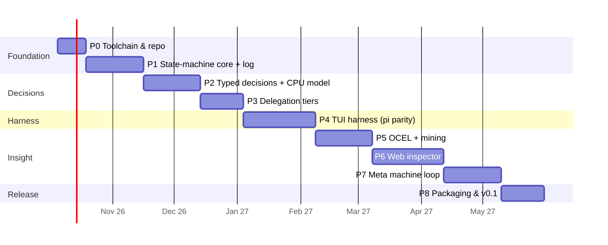

# Xeito — Implementation plan

Status: draft, 2026-09-27 · Architecture: [architecture/00-overview.md](architecture/00-overview.md) · Design: [design.md](design.md)

## Guiding rules

- **A vertical slice first.** By the end of P2, a real machine runs on the reference workstation with a real typed decision, and it is logged. Everything else deepens that slice.
- **Every phase ends in something runnable and a written exit check.** No phase starts before the previous one's exit criteria are met, with the exception of work marked *parallel*.
- **Dogfood from P4.** Xeito's own development tasks become its first machines.
- **Rough sizing** assumes one developer working part-time, about 10–15 h/week. The durations are calendar weeks at that pace.

---

## P0 · Toolchain and repository (≈2 weeks)

1. On the reference workstation, install Erlang/OTP 29.1 and Elixir 1.20.4 via **mise** (or asdf). Pin the versions in `.tool-versions` ([08](architecture/08-tech-stack.md#versions-to-pin-in-p0)).
2. Create the umbrella-less Mix project `xeito` with these top-level namespaces: `Xeito.Machine`, `Xeito.Run`, `Xeito.Decision`, `Xeito.Effects`, `Xeito.Log`, `Xeito.Tiers`.
3. Set up CI (GitHub Actions or Forgejo): `mix format --check-formatted`, `mix credo --strict`, `mix dialyzer` (or the built-in type checker), and `mix test`.
4. Build **llama.cpp**: a CPU build with AVX-512 (the small tier), plus Vulkan and HIP/ROCm builds for benchmarking against Ollama only.
   Run `llama-server` as a systemd *user* unit on `127.0.0.1:8081` ([09](architecture/09-reference-deployment.md#services)).
5. Run upstream **`laya-serve`** (laya-multilingual) as a pinned Docker container on `127.0.0.1:8082` with an API key file, and measure its CPU latency.
6. Download 2–3 small GGUF models, the candidates from [09](architecture/09-reference-deployment.md#tier-small-cpu). Record the SHA256 of each file in `models.lock`.
7. Write `LICENSE` (Apache-2.0 recommended), `CONTRIBUTING.md` and a code of conduct.

**Status (2026-09-27):** done. CI is green on GitHub; only the optional ROCm benchmark is pending. See [bench 0](../bench/0-baseline.md).

**Exit:** `mix test` is green in CI. `curl localhost:8081/completion` returns grammar-constrained JSON from a CPU model on the reference workstation. `llama-bench` numbers for each candidate are recorded in `bench/0-baseline.md`.

## P1 · State-machine core and event log (≈4 weeks)

1. Build the `Xeito.Machine` DSL, which compiles to a `%Machine{}` struct: states (hierarchical), events, guards, timeouts and finals ([02](architecture/02-state-machine-core.md)).
2. Add compile-time checks: every state reaches a final state, and every non-final state has a timeout. Verifying that decision values label transitions is stubbed until P2.
3. Implement the generic `Xeito.Run` (`gen_statem`, `handle_event_function`) that interprets a `%Machine{}`, plus `Xeito.RunSupervisor`.
4. Implement the effect runner with three tools, `read`, `write` and `bash`, and a fake runner for tests.
5. Implement `Xeito.Log`: an append-only writer to SQLite (via `exqlite`) using the OCEL 2.0 relational layout, with the event types from [05](architecture/05-event-log-and-process-mining.md#event-types).
6. Rebuild a run's state from the log after a crash (event sourcing).
7. Add exporters: Mermaid and SCXML from `%Machine{}`.
8. Write the first two machines, driven by code only with no model: `run_tests` and `fix_failing_test` (with a stubbed triage).

**Status (2026-09-27):** done.
- The DSL compiles to validated data, and a pure engine is shared by `Xeito.Run` and `Xeito.Run.Recovery`.
- `Xeito.Log` writes OCEL 2.0 in SQLite. PM4Py reads it natively (`read_ocel2_sqlite`).
- Local, fake and `:none` effect runners exist; `mix xeito.export` produces Mermaid and SCXML.
- 34 tests pass, including a property test (up to 1,000 runs), kill/restart and in-flight-effect recovery.

**Exit:** a property test shows that, for random event sequences, the log alone reproduces the final state. Killing a run mid-way and restarting it resumes in the same state. The Mermaid export of `fix_failing_test` matches [02](architecture/02-state-machine-core.md).

## P2 · Typed decisions and the CPU model (≈4 weeks)

1. Build the `Xeito.Decision` DSL: inputs, closed output type, rules, deciders and thresholds ([03](architecture/03-typed-decisions.md)).
2. Build the schema compiler: output type → JSON Schema → a backend-specific constraint (llama.cpp `json_schema`/GBNF, Ollama `format`, Anthropic tool schema).
3. Implement two small-tier clients:
   - `Xeito.Tiers.SystemOne`, which calls `/v1/systemone` (`laya-serve` now; any Jev-compatible backend later). It always pins `"model": "multilingual"`.
   - `Xeito.Tiers.Small` (`Req` → llama-server), which returns the value plus **token log-probabilities** for the enum alternatives.
   Decision types compile to `Choice`/`Score`/`Noul` requests for the first client ([03](architecture/03-typed-decisions.md#system-one-models-an-external-ecosystem-to-plug-into-sept-2026)).
4. Compute confidence: logprob-based as the primary source, self-consistency with k=3 as a fallback. Record both.
5. Make abstention a value, and complete the compile-time check that decision values match transitions.
6. Build the first decision types: `Intent`, `Triage`, `Risk`, `Done?`. Hand-label **150–200** examples each, covering every language the deployment actually sees, into `priv/decisions/*/examples.jsonl`. Seed the examples from real `mix test` failures and from shell history.
7. Add the eval task `mix xeito.eval <Decision>` for accuracy, macro-F1, ECE and latency p50/p95 per model.
8. Run the **three-way gate test** (rule vs calibrated small candidate vs local large model, cost-weighted, with a pre-declared margin). Pick the default small decider per decision type, and delete the losers ([03](architecture/03-typed-decisions.md#the-gate-test)).
9. Log the large model's verdicts as training data for the local fine-tuning of laya-multilingual in P7.

**Status (2026-09-27):** done, with an honest negative result. See [bench 2](../bench/2-decisions.md).
- Decision DSL, one-token logprob scoring, three tier clients, the decider ladder, `mix xeito.eval` and the gate are built.
- The seed sets are synthetic (45–128 per type).
- No small tier passed the zero-shot gate, so defaults are rules → large. The GPU-resident 27B model decides at ~500 ms with 0.93–0.99 accuracy.
- **Consequence for P3:** swap- and placement-aware routing (Q16) matters more than a fixed small→large cascade.

**Exit:** `fix_failing_test` runs end-to-end on a seeded failing repo, with `Triage` decided by the CPU model and logged with its confidence. The eval report for all four decision types is committed. `Risk` rules block the dangerous-command test set 100% of the time.

## P3 · Delegation tiers (≈3 weeks)

1. Implement the escalation machine ([04](architecture/04-delegation.md)), itself a `%Machine{}` running as a child run.
2. Add tier clients. `Large` uses the Ollama API on `:11434` with `format` = JSON Schema, detects which model is loaded (`/api/ps`), and models the swap substate. `Remote` uses ReqLLM (Anthropic) with tool-use schemas. `Human` asks through the TUI or a CLI prompt.
3. Add the policy DSL and guards for data locality, budgets and a maximum number of swaps.
4. Implement cost accounting per decision and per run: tokens, currency, wall-clock and estimated energy.
5. Batching: queue large-tier decisions per model so that swaps are avoided. Batch System One questions per state into one request, and give each backend a queue with its measured capacity ([bench 1](../bench/1-contention.md)).

**Status (2026-09-27):** done. See [bench 3](../bench/3-escalation.md).
- The escalation machine runs as a logged child run, with swaps as states.
- Policy: remote off by default, local-only data never leaves the box, and Risk can never go remote (tested). Per-run budgets for spend and swaps; per-backend queues.
- Remote tier (stub-tested; no credentials on the reference box).
- Cost and estimated energy per decision and per run. Held-out threshold tuning.
- Exit measured: Qwen-2B takes 78% / 53% / 37% of done / intent / triage decisions at unchanged accuracy. `done` meets the <30% large-share target; intent and triage don't yet.

**Exit:** on the eval sets, the cascade (rules → small → large) matches or beats large-only accuracy while calling `large` for fewer than 30% of decisions (target to be confirmed in P2). The remote tier is provably never called for `Risk` (test). The swap state appears in the logs.

## P4 · TUI harness at pi parity (≈5 weeks)

1. Build a minimal terminal UI: an input box, a streaming transcript, a status line (machine / state / tier / cost) and a diff view.
   Use TermUI by default and spike ExRatatui if needed. The TUI is a separate Burrito binary talking to `xeitod` ([07](architecture/07-harness-frontend.md#processes-and-clients), [08](architecture/08-tech-stack.md#the-tui-the-weakest-link)).
2. Provide a **free chat machine**, the escape hatch: `idle → thinking → tool_use → idle`, with the large model deciding `ToolChoice`. This gives rough pi parity for unstructured use, and the machine is still logged.
3. Build machine selection from `Intent` (e.g. "the tests fail" → `fix_failing_test`).
4. Add step mode and breakpoints in the TUI ([06](architecture/06-observability.md#2-step)).
5. Support project context files (`AGENTS.md`), and read pi's skills directory format where feasible.
6. Add session save/resume, which comes for free from the log.
7. Write the optional `pi-xeito` bridge extension ([07](architecture/07-harness-frontend.md#pi-bridge-optional)).
8. **Dogfood.** Use Xeito for its own development for at least two weeks, and log the friction as issues.

**Exit:** a two-week dogfood log with ≥ 50 runs. At least five structured machines are in daily use. Median latency of `Intent` + first token is under 1.5 s on the reference workstation.

## P5 · OCEL export and process mining (≈4 weeks)

1. Validate the SQLite layout against the OCEL 2.0 spec, and add JSON export.
2. Build a Python sidecar (`tools/mining/`, managed by `uv`) using PM4Py: object-centric discovery, flattening, DFG, Inductive Miner, and alignments against the machines' Petri-net exports.
3. Build the Elixir side: native DFG and variants for the live views, and `mix xeito.mine` to run the sidecar and ingest its findings as structured records.
4. Implement the proposal generators from the table in [05](architecture/05-event-log-and-process-mining.md#kinds-of-proposal). Start with rule-based ones only.
5. Publish an anonymised sample log. This is useful for research partners and for grant evidence.

**Exit:** a weekly mining report generated from the dogfood logs, with ≥ 3 actionable proposals. PM4Py loads `.xeito/log.sqlite` without conversion.

## P6 · Web inspector (≈5 weeks)

1. **Spike (1 week):** build the machine view in **Hologram** and, as a fallback, in **Phoenix LiveView**. Pick one using the criteria in [08](architecture/08-tech-stack.md#decision-procedure).
2. Build the views in the order given in [06](architecture/06-observability.md#views-web-inspector): timeline → machine view → step debugger → decision table → mining dashboard.
3. Relabelling a decision in the UI writes to the eval set, closing the labelling loop.
4. Bind the inspector to `127.0.0.1` only. Remote access goes through an SSH tunnel or a private VPN.

**Exit:** a run started in the TUI can be watched, paused, stepped and replayed from the browser. A decision can be relabelled and shows up in the next `mix xeito.eval`.

## P7 · Meta machine: mining-driven improvement (≈4 weeks)

1. Implement the meta machine itself as a Xeito machine ([05](architecture/05-event-log-and-process-mining.md#the-meta-state-machine)).
2. Add counterfactual replay (`re-decide`, `re-machine`) as the benchmarking gate.
3. Add graduation of decision types: fine-tune and calibrate laya-multilingual locally on the logged verdicts (the "stuntd" pattern), then graduate to a classifier (Bumblebee embedding + logistic head) and on to a rule ([03](architecture/03-typed-decisions.md)).
4. Let the large or remote model draft proposals from the mining output. A human reviews every proposal.
5. Automate threshold tuning (θs, θl) per decision type ([04](architecture/04-delegation.md#tuning-thresholds-from-the-log)).

**Exit:** at least one decision type has graduated to a classifier with equal or better F1. At least one machine revision was proposed by mining, accepted and benchmarked. The determinism budget of the dogfood machines has measurably increased since P4.

## P8 · Packaging, docs and v0.1 (≈3 weeks)

1. Package as a single-binary CLI (Burrito) plus `mix release` for the server mode.
2. Write an install script for Linux, with an Ubuntu-based recipe, llama.cpp setup and model download.
3. Write documentation: a machine-authoring guide, a decision-authoring guide, and the benchmark protocol.
4. Write up the reference benchmark ([09](architecture/09-reference-deployment.md#benchmark-protocol)) as a blog post, with a talk proposal.
5. Tag v0.1.0.

**Exit:** a fresh Ubuntu-based machine goes from install to the first `fix_failing_test` run in under 15 minutes.

---

## Cross-cutting tracks (parallel)

| Track | When | What |
|---|---|---|
| Eval data | P2 → | Keep growing the labelled decisions. Every human override is a label. |
| Benchmarks | P0 → | Nightly `bench/` run on the reference workstation: hardware, models, decisions, machines. |
| Writing | P1 → | One short post per phase. It feeds the grant narratives and talks. |

## Risks and mitigations

| Risk | Mitigation |
|---|---|
| Hologram is too immature for the inspector | The P6 spike includes a LiveView fallback. Both are JS-free for us. |
| Small CPU models are not accurate enough | The cascade covers the gap. Measure in P2 before building P3 on assumptions. |
| ROCm instability on consumer AMD GPUs | Keep a llama.cpp Vulkan build as a fallback. |
| Machines feel rigid for exploratory work | The free chat machine (P4.2) is always available, and it is still logged and mined. |
| Scope creep toward a "platform" | Rule 6 in [01](architecture/01-principles.md): new behaviour is a machine, not a feature. |
